# 1. 数字电路基础知识


## 数字电路

​	数字电路是利用电源电压的高电平和低电平分别表示1和0，进而实现信息的表达

​	**模拟信号**：随时间连续变化的信号。处理模拟信号的电路就是模拟电路

​	**数字信号**：随时间不连续变化的信号，离散变化。处理数字信号的电路就是数字电路

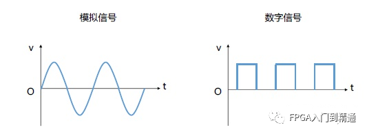


## 数值表达

​	我们常用的数值表达方式是十进制，但在数字电路中采用的是二进制

​	无符号二进制：

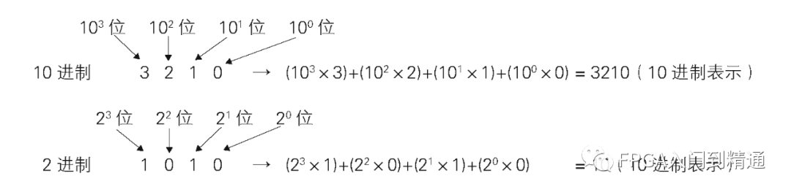

​	有符号二进制：

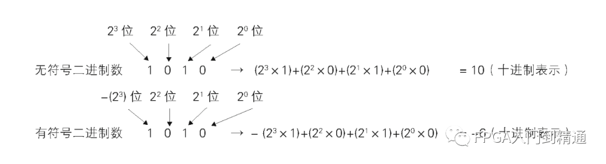


## 比特和字节

​	**比特**：二进制中的一个数字位称为binary digit，用bit表示，常简写为“b”

​	**字节**：1字节等于8比特，用byte表示，常简写为“B”


## 1K字节理解的差异

​	K、M、G、T是表示大数据量时常用的单位。1K的大小有1000（10的3次方）和1024（2的10次方）两种计数方法

​	通常衡量计算机内存和网络数据包大小时，1K相当于1024比特。而在硬盘等存储器的标签上记述的尺寸或物理学中的1K相当于1000

|      | 1K=1024时                      | 1K=1000时                       |
| ---- | ------------------------------ | ------------------------------- |
| 1K   | 1 024（2的10次方）             | 1 000（10的3次方）              |
| 1M   | 1 048 576（2的20次方）         | 1 000 000（10的6次方）          |
| 1G   | 1 073 741 824（2的30次方）     | 1 000 000 000（10的9次方）      |
| 1T   | 1 099 511 627 776（2的40次方） | 1 000 000 000 000（10的12次方） |


## 反码和补码

### 正数

​	正数的原码、反码、补码都是相同的

### 负数

​	**1、原码与反码相互转换**

​	a、原码转反码：符号位不变，数值位按位取反

```text
原码：1000 1100
反码：1111 0011
```

​	b、反码转原码：符号位不变，数值位按位取反

```text
反码：1011 0101
原码：1100 1010
```

​	**2、原码和补码的相互转换**

​	a、原码转补码：原码转反码，反码末位加一

```text
原码：1010 0101
反码：1101 1010
补码：1101 1011
```

​	b、补码转原码：补码符号位不变，数值位按位取反，末位加一

```text
补码：1110 1011
补码取反：1001 0100
原码：1001 0101
```

​	**3、反码和补码的相互转换**

​	a、反码转补码：末位加一

```text
反码：1100 1110
补码：1100 1111
```

​	b、补码转反码：末位减一

```text
补码：1100 1110
反码：1100 1101
```


## MOSFET的结构

​	目前数字电路基本上都是由MOSFET场效应管构成的。MOSFET是一种在施加电压后可以像开关一样工作的半导体器件。MOSFET有P型和N型MOSFET两种，如下图所示：

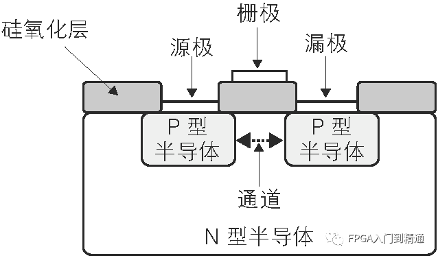

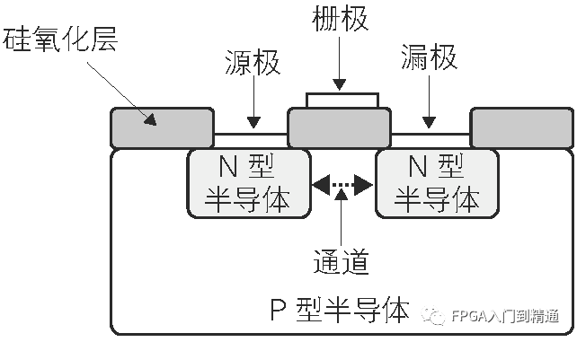


## 逻辑运算与基本逻辑电路

​	逻辑运算使用AND（逻辑与）、OR（逻辑或）、NOT（逻辑非）三种基本运算来实现各种运算

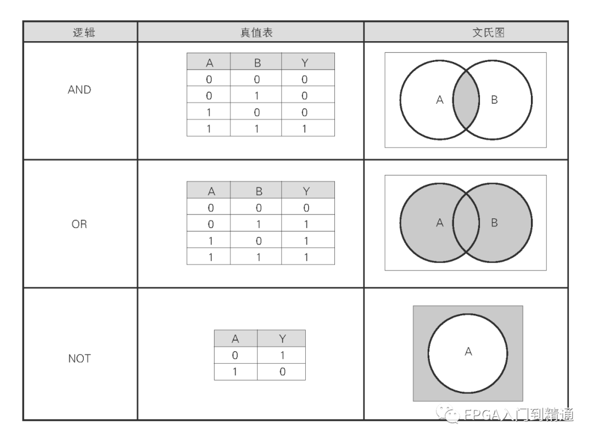

​	CMOS基本逻辑门电路

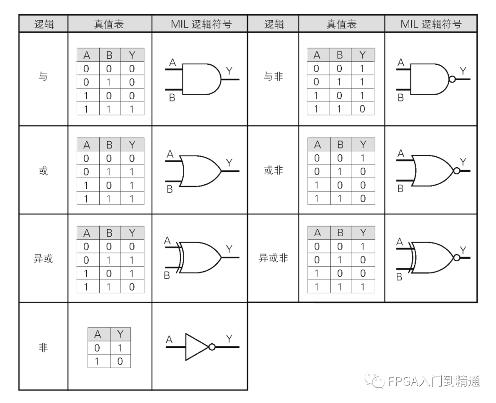


## 存储元件

​	锁存器（Latch）就是一种存储元件，具有像闩锁一样锁住并维持数据的特性，通过基本的逻辑门可以实现

### 最简单的锁存器

​	由一个2输入的AND门组成，将一路输入与输出连接形成回路

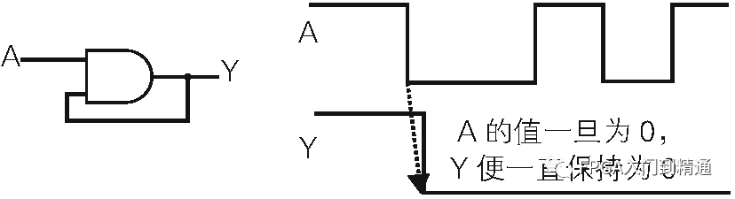

### D锁存器

​	Data Latch（D-Latch，数据锁存器）

​	**结构组成**：由4个NAND组成，输入信号有D（DATA）和E（ENABLE），输出信号有 Q 和 <span style="text-decoration: overline;">Q</span>

​	**工作逻辑**：E为0时保持前一个数据，E为1时将输入D的数据输出到Q，E为1时输入的D直接通过Q输出

​	D锁存器构成以及电路组成如下：

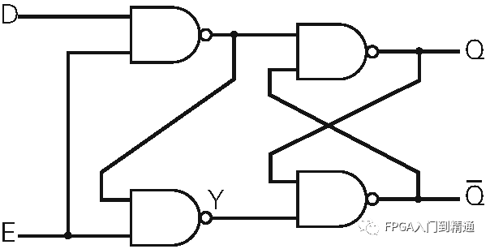

​	真值表：

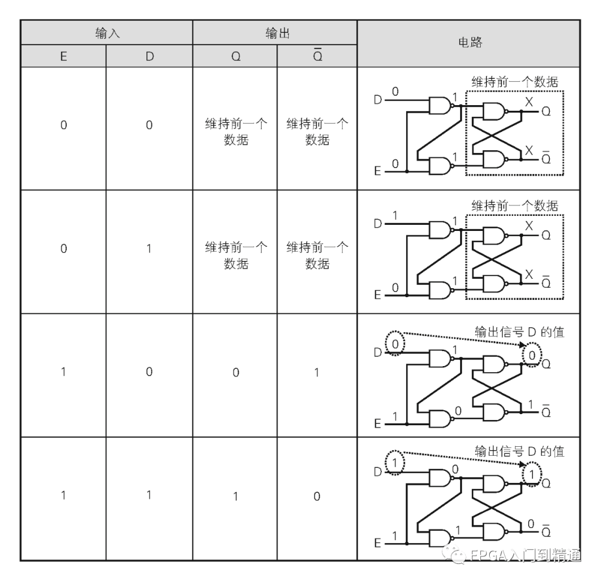

### D触发器

​	D锁存器和NOT门组合，可以实现依据时钟信号同步并保存数据的D触发器

​	D触发器有D（Data）和C（Clock）两个输入信号， Q 和 <span style="text-decoration: overline;">Q</span>两个输出信号

​	D触发器电路组合如下图所示：

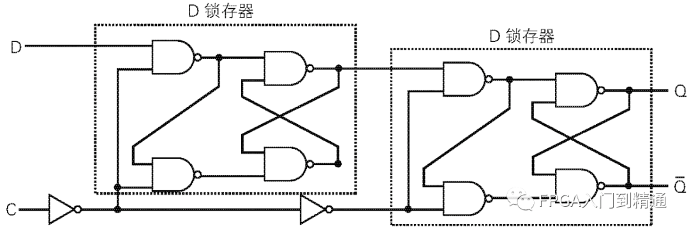

​	D触发器电路符号：

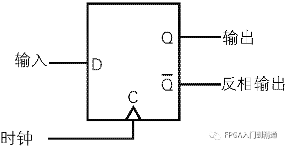

​	**工作逻辑**：当D触发器C为0时，前端D锁存器输出信号D的值，后端D锁存器保持之前的数据；当C为1时，前端D锁存器保持之前的数据，后端D锁存器将前端D锁存器保持的数据直接通过Q输出

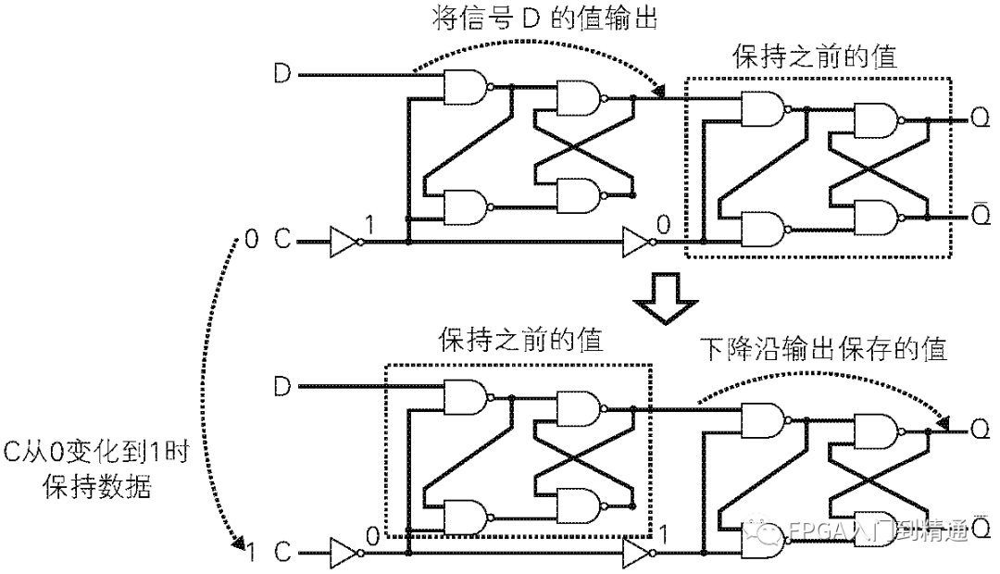

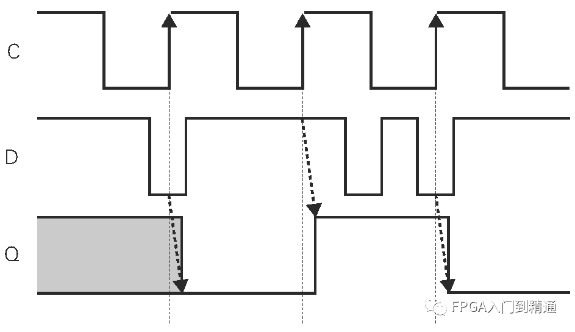

​	D触发器由于原理和构造简单，广泛应用于同步电路


## 建立时间和保持时间

​	D触发器是由时钟信号的边沿来触发数据的存储动作的。因此，需要在时钟沿前后一段时间内将输入信号稳定下来。如果在时钟变化时输入信号也在变化，很可能无法正确存储数据，

​	因此，为了让D触发器正确存储数据，需要建立时间（setup time）和保持时间（hold time）两个基本条件

​	**建立时间**：在时钟变化前必须稳定输入信号的时间

​	**保持时间**：在时钟变化后必须稳定输入信号的时间

​	同时遵守建立时间和保持时间，就可以让D触发器正确的存储数据

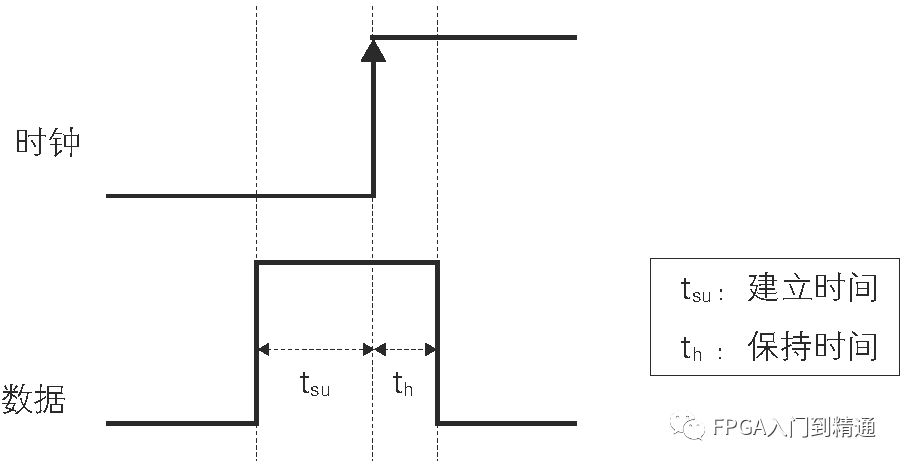


## 组合逻辑电路和时序逻辑电路

​	数字电路可以分为组合逻辑电路和时序逻辑电路

### 组合逻辑电路

​	组合逻辑电路是指输出值仅由输入信号的状态决定的电路，不仅依赖于过去的输入。从电路组成上来看，只包含门电路，不包含存储元件，下图就是一个组合逻辑电路：

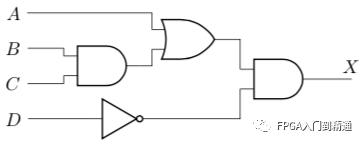

### 时序逻辑电路

​	时序逻辑电路是指输出值同时依赖于现在和过去输入信号的逻辑电路

​	从电路组成上来看，时序逻辑电路等于组合逻辑电路 + 存储电路

​	从工作逻辑上来看，输出状态必须反馈到输入端，与输入信号共同决定组合逻辑的输出

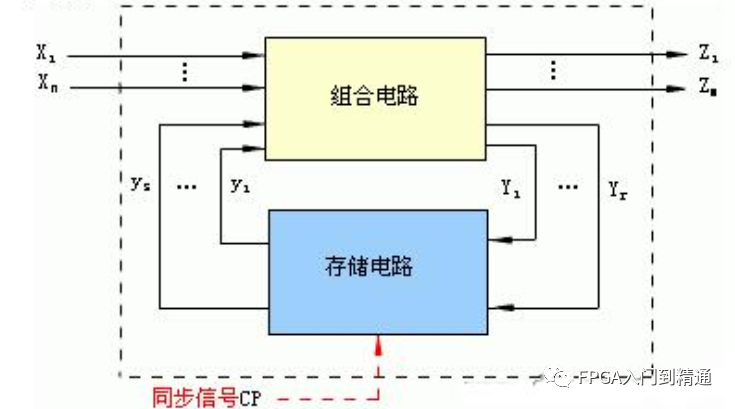