# 11. 跨时钟域处理

## 应用场景

如在100MHz时钟下生成了一个单时钟周期的高电平脉冲，想要用50MHz时钟进行采集（即同步到50MHz时钟下），可能会导致采集失败或者亚稳态

因为100MHz高电平脉冲的持续时间只有50MHz高电平脉冲持续时间的一半

因此要引入跨时钟域处理，将100MHz高电平脉冲扩宽

## 建立时间和保持时间

信号采样需要一个有一定持续时间的窗口期

时序电路的基础是触发器（FF，Flip-Flop）

**建立时间**

​	在触发器的时钟信号上升沿到来之前，数据保持稳定不变的时间，如果建立时间不够，数据将不能在这个时钟上升沿被稳定地打入触发器，T~su~就是这个最小稳定时间

**保持时间**

​	在触发器的时钟信号上升沿到来之后，数据稳定不变的时间，如果保持时间不够，数据同样不能被稳定地打入触发器，T~h~就是这个最小的保持时间

## 亚稳态

### 概念

如果数据传输中不满足触发器的T~su~和T~h~，就可能产生亚稳态，此时触发器输出端Q在有效时钟沿之后比较长的一段时间处于不确定的状态，在这段时间里Q端在0和1之间处于振荡状态，而不是等于数据输入端D的值，这段时间称为决断时间T~met~（resolution time）。经过resolution time之后Q端将稳定到0或1商，但是稳定到0或1是随机的，与输入没有必然关系

亚稳态振荡时间T~met~关系到后级寄存器的采集稳定问题，T~met~影响因素包括：器件的生产工艺、温度、环境以及寄存器采集到亚稳态里稳定态的时刻等，甚至于某些特定条件，如干扰、辐射等都会造成T~met~增长

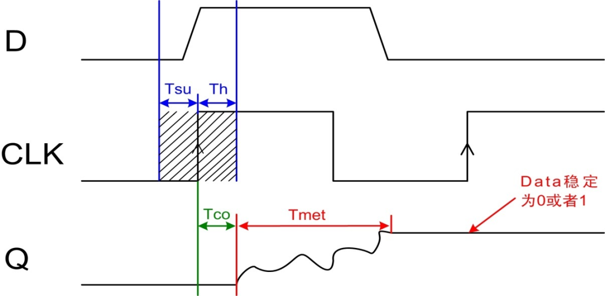

只要系统中有异步元件，亚稳态就是无法避免的，亚稳态主要发生在异步信号检测、跨时钟域信号传输以及复位电路等常用设计中。由于产生亚稳态后，寄存器Q端输出在稳定下来之前可能是毛刺、振荡、固定的某一电压值。在信号传输中产生亚稳态就会导致与其相连其它数字部件作出不同的判断，有的判断到“1”，有的判断到“0”，有的也进入了亚稳态，数字部件将会逻辑混乱

#### 预防

首先，在同步系统中，输入信号总是与系统时钟同步，能够达到寄存器的时序要求，所以亚稳态肯定不会发生。在异步系统的信号输出过程中，如果无法满足建立时间和保持时间的要求，则会发生亚稳态

预防亚稳态的方法就是将输入信号（单bit信号）打拍，也就是在要使用的时钟域下，将信号寄存

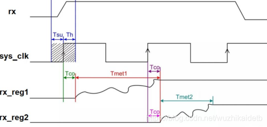

rx是相对于时钟域sys_clk的异步信号，rx_reg1、rx_reg2分别是rx在时钟域sys_clk打一拍（寄存一次，可以理解为延迟一个时钟周期）、打两拍（寄存两次，延迟两个时钟周期）的信号。可以看到rx_reg1可能还存在低概率的亚稳态现象，当然rx_reg2虽然在示意图里是稳定的，不过实际过程中也仍然存在亚稳态发生的概率

单比特信号从慢速时钟域同步到快速时钟域需要使用打两拍的方式消除亚稳态。第一级寄存器发生亚稳态并经过自身后可以稳定输出的概率为70%~80%左右，第二级寄存器可以稳定输出的概率为99%左右，后面再多加寄存器的级数改善效果就不明显了，所以数据进来后一般选择打两拍即可。该方法仅仅使用单比特信号从慢速时钟域同步到快速时钟域，单比特信号从快速时钟域同步到慢速时钟域还仅仅使用打两拍的方式则会漏采数据

此外，还可用异步FIFO缓存，写端和读端分别对应两个时钟域，由空/满信号控制着读写过程，实现数据的跨域传输

## 多级寄存器处理

### 单比特单周期慢到快

同步代码如下：

```verilog
//单bit单周期信号跨时钟域，慢到快，不采用fifo
module cross0 #(
	parameter DW = 8
)
(
	input 		clka		,
	input 		clkb		,
	input 		pulse_a		,		
	output 		pulse_b				
);

reg	[DW-1:0]	pulse_a_shift	= 0;
reg				ext_pulse_a		= 0;

reg 			pulse_a_r		= 0;
reg 			pulse_a_r1		= 0;
reg 			pulse_a_r2		= 0;
 
always@(posedge clka)
	pulse_a_shift <= {pulse_a_shift[DW-2:0],pulse_a};
	
always@(posedge clka)
	ext_pulse_a <= |pulse_a_shift; 
	
always@(posedge clkb)
	begin
		pulse_a_r  <= ext_pulse_a	;
		pulse_a_r1 <= pulse_a_r	    ;		
		pulse_a_r2 <= pulse_a_r1	;	
	end

assign pulse_b = ~pulse_a_r2&&pulse_a_r1;
 
endmodule
```

同步效果如下图所示：

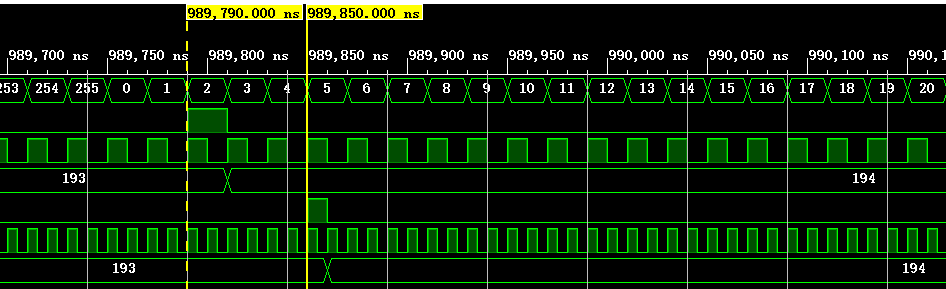

### 单比特单周期快到慢

其代码实现与单比特单周期慢到快一致，如下：

```verilog
//单bit单周期信号跨时钟域，慢到快，不采用fifo
module cross0 #(
	parameter DW = 8
)
(
	input 		clka		,
	input 		clkb		,
	input 		pulse_a		,		
	output 		pulse_b				
);
	reg	[DW-1:0]	pulse_a_shift	= 0;
	reg				ext_pulse_a		= 0;

	reg 			pulse_a_r		= 0;
	reg 			pulse_a_r1		= 0;
	reg 			pulse_a_r2		= 0;
	 
	always@(posedge clka)
		pulse_a_shift <= {pulse_a_shift[DW-2:0],pulse_a};
		
	always@(posedge clka)
		ext_pulse_a <= |pulse_a_shift; 
		
	always@(posedge clkb)//打3拍
		begin
			pulse_a_r  <= ext_pulse_a	;
			pulse_a_r1 <= pulse_a_r	    ;
			pulse_a_r2 <= pulse_a_r1	;	
		end

	assign pulse_b = ~pulse_a_r2&&pulse_a_r1;
endmodule
```

同步效果如下图所示：


## FIFO异步缓存

会消耗BRAM、LUT等资源

### 单比特单周期慢到快

代码实现如下：

```verilog
module cross1 (
	input 		 clka			,
	input 		 clkb			,
	input 		 pulse_a		,		
	output 		 pulse_b				
);
	wire			empty		;
	reg				cnt_de	 = 0; 
	reg		[7:0]	cnt		 = 0;	
	fifo_1bit u1_fifo_1bit (
	  .wr_clk		(clka		), 	
	  .rd_clk		(clkb		), 	
	  .din			(1'b1		), 	
	  .wr_en		(pulse_a	), 	
	  .rd_en		(~empty		), 	
	  .dout			(			), 	
	  .full			(			), 	
	  .empty		(empty		)  	
	);
	assign pulse_b = ~empty;
endmodule
```

其中fifo ip核的配置如下：

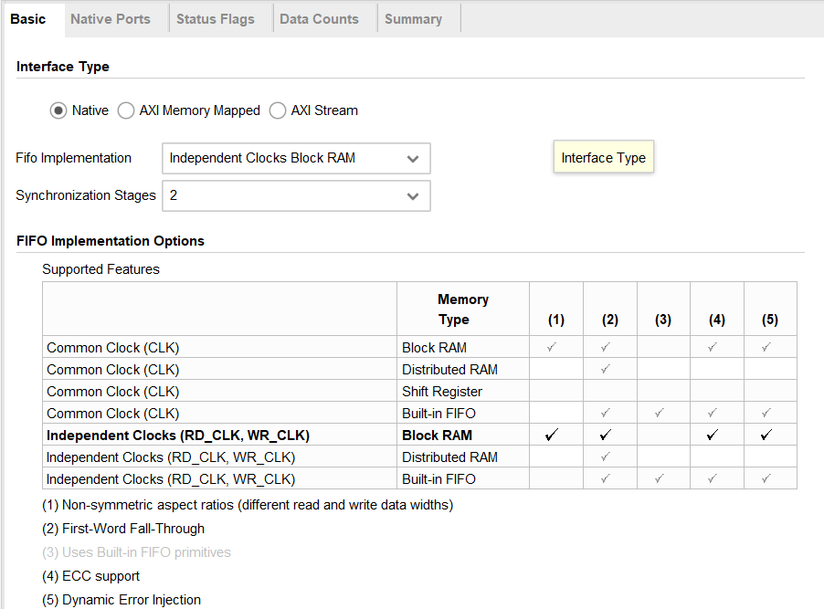

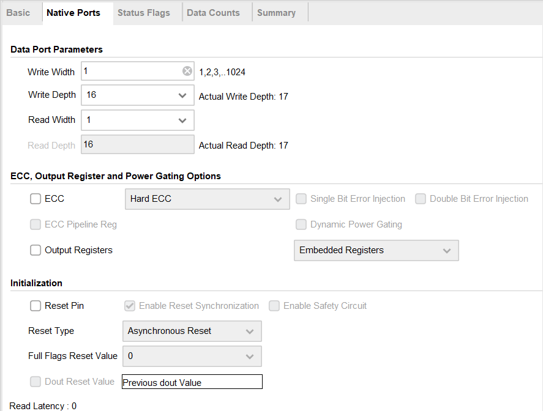

FIFO深度设置为16即可，由于是单比特信号的跨时钟域处理，宽度设置为1即可，此外Status Flags和Data Counts保持默认即可

同步效果如下：

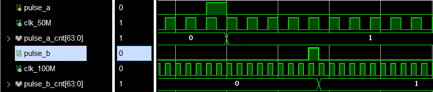

### 单比特多周期慢到快

多周期时，一般会知道原时钟域的周期数（DLEN），这种情况下输入的pulse_a不是本来的多周期脉冲，而是多周期脉冲的上升沿，即将多个周期转为单个周期，再在新的时钟域下计数，代码实现如下：

```verilog
module cross1 #(
	parameter DLEN = 10
)
(
	input 		 clka			,
	input 		 clkb			,
	input 		 pulse_a		,		
	output 		 pulse_b				
);
	wire			empty		;

	reg				cnt_de	 = 0; 
	reg		[7:0]	cnt		 = 0;	


	fifo_1bit u1_fifo_1bit (
	  .wr_clk		(clka		), 	
	  .rd_clk		(clkb		), 	
	  .din			(1'b1		), 	
	  .wr_en		(pulse_a	), 	
	  .rd_en		(~empty		), 	
	  .dout			(			), 	
	  .full			(			), 	
	  .empty		(empty		)  	
	);

	always@(posedge clkb)
		if(cnt==DLEN-1)	
			cnt_de <= 1'b0;	
		else if(~empty)
			cnt_de <= 1'b1;	
		else
			cnt_de <= cnt_de;

	always@(posedge clkb)
		if(cnt==DLEN-1)	
			cnt <= 0;	
		else if(cnt_de==1'b1)
			cnt <= cnt + 1'b1;	
		else
			cnt <= cnt;

	assign pulse_b = cnt_de;
 
endmodule
```

由于是采用单周期同步，再到新时钟域下计数的方法，因此，FIFO的配置与单比特单周期相同，此外，上升沿检测代码为：

```verilog
always @(posedge clka) begin
	pulse_a_r <= pulse_a;

assign pulse_a_pose = ~pulse_a_r && pulse_a;
```

同步效果如下：

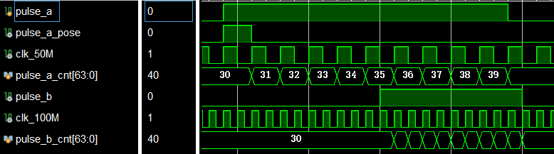

### 单比特单周期快到慢

同步方式与单比特单周期慢到快的方法一致，实现方式如下：

```verilog
module cross1 (
	input 		 clka			,
	input 		 clkb			,
	input 		 pulse_a		,		
	output 		 pulse_b				
);
	wire			empty		;
	reg				cnt_de	 = 0; 
	reg		[7:0]	cnt		 = 0;	
	fifo_1bit u1_fifo_1bit (
	  .wr_clk		(clka		), 	
	  .rd_clk		(clkb		), 	
	  .din			(1'b1		), 	
	  .wr_en		(pulse_a	), 	
	  .rd_en		(~empty		), 	
	  .dout			(			), 	
	  .full			(			), 	
	  .empty		(empty		)  	
	);
	assign pulse_b = ~empty;
endmodule
```

FIFO IP核的配置与单比特单周期慢到快一致

同步效果如下：

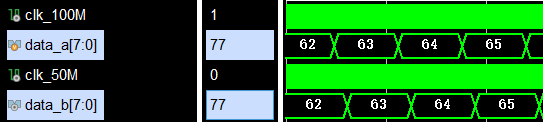

### 单比特多周期快到慢

单比特多周期快到慢的实现和IP配置都跟单比特多周期慢到快一致，同样也要求知道周期数（DLEN），代码实现如下：

```verilog
module cross1 #(
	parameter DLEN = 10
)
(
	input 		 clka			,
	input 		 clkb			,
	input 		 pulse_a		,		
	output 		 pulse_b				
);
	wire			empty		;

	reg				cnt_de	 = 0; 
	reg		[7:0]	cnt		 = 0;	


	fifo_1bit u1_fifo_1bit (
	  .wr_clk		(clka		), 	
	  .rd_clk		(clkb		), 	
	  .din			(1'b1		), 	
	  .wr_en		(pulse_a	), 	
	  .rd_en		(~empty		), 	
	  .dout			(			), 	
	  .full			(			), 	
	  .empty		(empty		)  	
	);

	always@(posedge clkb)
		if(cnt==DLEN-1)	
			cnt_de <= 1'b0;	
		else if(~empty)
			cnt_de <= 1'b1;	
		else
			cnt_de <= cnt_de;

	always@(posedge clkb)
		if(cnt==DLEN-1)	
			cnt <= 0;	
		else if(cnt_de==1'b1)
			cnt <= cnt + 1'b1;	
		else
			cnt <= cnt;

	assign pulse_b = cnt_de;
 
endmodule
```

同步效果如下：

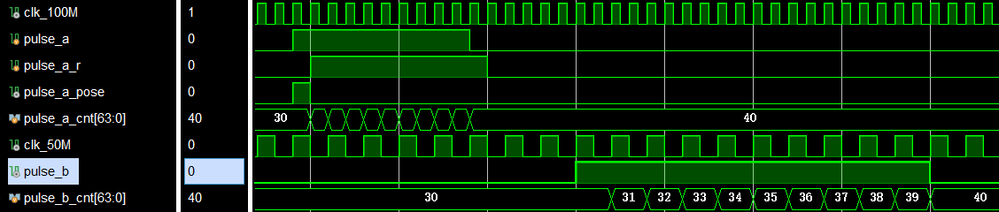

### 单字节慢到快

与单比特不同的是，多比特不适合打拍，直接用FIFO就好

代码实现如下：

```verilog
module cross4 (
	input 			clka		,
	input 			clkb		,
	input 	[7:0]	data_a		,
	output 	[7:0]	data_b			
);
	wire	empty	;

	fifo_8bit u1_fifo_8bit (
	  .wr_clk		(clka		), 	
	  .rd_clk		(clkb		), 	
	  .din			(data_a		), 	
	  .wr_en		(1'b1		), 	
	  .rd_en		(~empty		), 	
	  .dout			(data_b		), 	
	  .full			(			), 	
	  .empty		(empty		)  	
	);	
endmodule
```

同步效果如下：

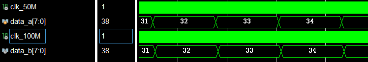

### 单字节快到慢

代码实现与多比特慢到快一致，如下所示：

```verilog
module cross4 (
	input 			clka		,
	input 			clkb		,
	input 	[7:0]	data_a		,
	output 	[7:0]	data_b			
);
	wire	empty	;

	fifo_8bit u1_fifo_8bit (
	  .wr_clk		(clka		), 	
	  .rd_clk		(clkb		), 	
	  .din			(data_a		), 	
	  .wr_en		(1'b1		), 	
	  .rd_en		(~empty		), 	
	  .dout			(data_b		), 	
	  .full			(			), 	
	  .empty		(empty		)  	
	);	
endmodule
```

同步效果如下图所示：

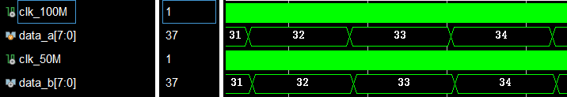

### 多字节慢到快

代码实现如下，其中IW是字节数，DLAY需要计算，保证FIFO连续输出的同时延时最小，详情见FIFO IP核那一小节：

```verilog
module cross5 #(
	parameter IW   = 256	,
	parameter DLAY = 5 
)
(
	input 				clka			,
	input 				clkb			,
	input				data_a_de		,
	input 		[7:0]	data_a			,
	output	reg			data_b_de	= 0	,	
	output 		[7:0]	data_b		
);

	wire		empty			;
	wire [10:0] rd_data_count	;

	reg	 [15:0]	cnt	= 0			;

	always@(posedge clkb)
		if(cnt==IW-1)
			data_b_de <= 1'b0;
		else if(rd_data_count>=DLAY)
			data_b_de <= 1'b1;
		else
			data_b_de <= data_b_de;

	always@(posedge clkb)
		if(cnt==IW-1)
			cnt <= 0;
		else if(data_b_de==1'b1)
			cnt <= cnt + 1'b1;
		else
			cnt <= cnt;
			
	fifo_8bit u1_fifo_8bit (
		.wr_clk			(clka			), 	
		.rd_clk			(clkb			), 	
		.din			(data_a			), 	
		.wr_en			(data_a_de		), 	
		.rd_en			(data_b_de		), 	
		.dout			(data_b			), 	
		.full			(				), 	
		.empty			(empty			),
		.rd_data_count	(rd_data_count	),
		.wr_data_count	(				) 
	);	 
endmodule
```

同步效果如下：

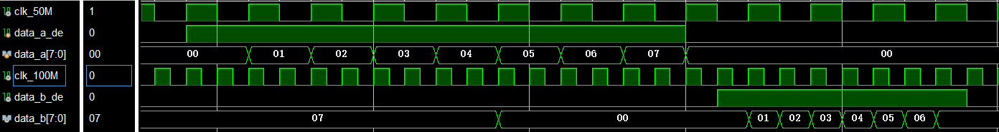

### 多字节快到慢

代码实现如下：

```verilog
module cross5 #(
	parameter IW   = 256	,
	parameter DLAY = 5 
)
(
	input 				clka			,
	input 				clkb			,
	input				data_a_de		,
	input 		[7:0]	data_a			,
	output	reg			data_b_de	= 0	,	
	output 		[7:0]	data_b		
);

	wire		empty			;
	wire [10:0] rd_data_count	;

	reg	 [15:0]	cnt	= 0			;

	always@(posedge clkb)
		if(cnt==IW-1)
			data_b_de <= 1'b0;
		else if(rd_data_count>=DLAY)
			data_b_de <= 1'b1;
		else
			data_b_de <= data_b_de;

	always@(posedge clkb)
		if(cnt==IW-1)
			cnt <= 0;
		else if(data_b_de==1'b1)
			cnt <= cnt + 1'b1;
		else
			cnt <= cnt;
			
	fifo_8bit u1_fifo_8bit (
		.wr_clk			(clka			), 	
		.rd_clk			(clkb			), 	
		.din			(data_a			), 	
		.wr_en			(data_a_de		), 	
		.rd_en			(data_b_de		), 	
		.dout			(data_b			), 	
		.full			(				), 	
		.empty			(empty			),
		.rd_data_count	(rd_data_count	),
		.wr_data_count	(				) 
	);	 
endmodule
```

同步效果如下图所示：

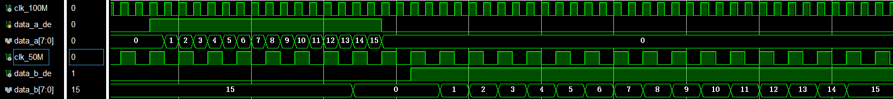


