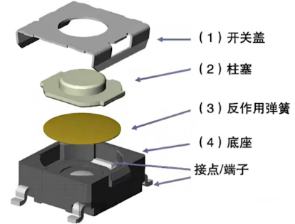
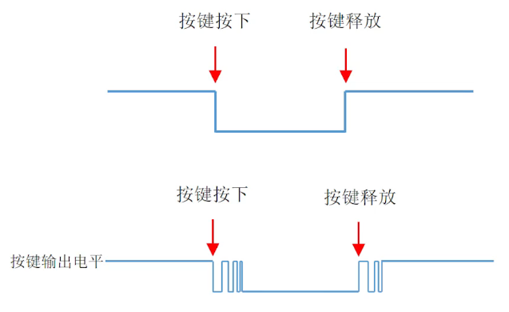
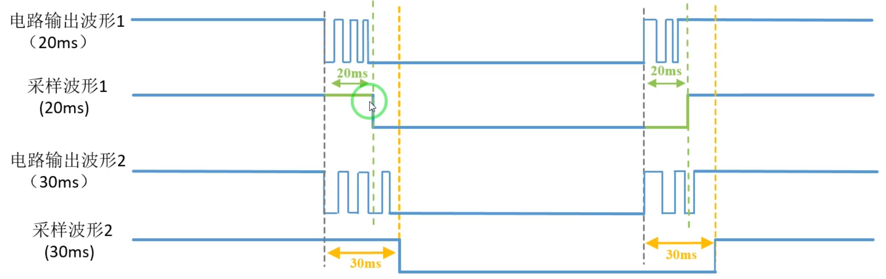
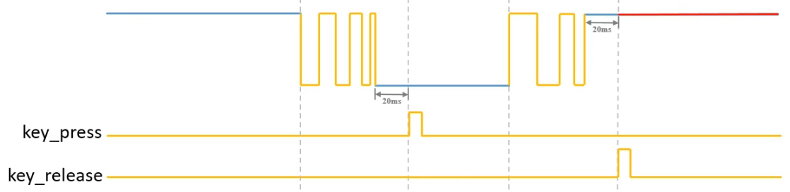

# 16. 按键消抖

## 产生原理

​	一般开发板上的按键都是机械按键，其结构如下图所示：

​	所以在按下和松开的时候会产生回弹，导致按键按下但不一定真的按下了，按键弹起来但不一定真的弹起来了

​	一般抖动周期远远大于FPGA的工作时钟周期，抖动时间可能为20ms左右，而100MHz时钟周期仅为10ns

​	以上面的波形为例，对于理想的波形，每次按下只能检测到一次下降沿，每次松开只能检测到一次上升沿；对于实际存在抖动的波形，可能存在多个上升沿或多个下降沿

​	根据上面的实际波形，可以把按键工作分为下面五个状态：

​	1、按键未按下时，空闲态，电路输出高电平

​	2、按键按下抖动，电路输出在高低电平间跳转

​	3、按下抖动停止，静止态，电路输出低电平

​	4、按键松开抖动，电路输出在高低电平间跳转

​	5、松开抖动停止，电路输出高电平

## 消抖方法

​	**思路一**

​	按键按下时，当检测到下降沿后，延时20ms再读取按键值判断是否按下

​	按键释放后，当检测到上升沿后，延时20ms再读取按键值判断是否释放

​	当按键遭受腐蚀等情况的话，会导致20ms后可能也没进入稳定状态，从而导致误判，FPGA有条件也有能力用更精妙的方法

​	**思路二**

​	按键按下时，在检测到下降沿后，判断低电平的持续时间，若低于20ms，认为是抖动；若超过20ms，则认为按键按下

​	按键释放时，在检测到上升沿后，判断高电平的持续时间，若低于20ms，认为是抖动；若超过20ms，则认为按键释放

### 按键消抖状态分析

**空闲态**：等待按键按下（等待下降沿），一旦出现下降沿，就开始20ms的计时

**按下消抖状态**：20ms的计时状态，计时期间如果出现上升沿，回到空闲态；如果计时满20ms，未出现上升沿，发出按键按下通知信号

**等待释放状态**：等待按键释放（等待上升沿），一旦出现上升沿，就开始20ms的计时

**释放消抖状态**：20ms的计时状态，计时期间如果出现下降沿，回到等待释放状态；如果计时满20ms，未出现下降沿，发出按键释放的通知信号

