# 2. FPGA内部结构


## FPGA组成

### Intel/Altera FPGA

​	Intel/Altera FPGA组成：ALMs、LEs、RAM、DSP、Blocks、Multiploers、PLLs等

​	Intel/Altera的可编程逻辑单元通常称为LE（Logic Element，逻辑单元），由一个Register和一个LUT组成，再将10个LE有机组合起来，构成更大的逻辑功能单元——逻辑阵列模块（LAB，Logic Array Block），LAB中还包含LE间的进位链、LAB控制信号、LUT级联链、局部互连线资源、寄存器级联链等连线和控制资源


### Xilinx FPGA组成

​	**Xilinx FPGA组成**：CLB（Configable Logic Block）包含Slices和DRAM。CLB是由Slices构成的，每一个Slices基本是由LUT、进位链、MUX和寄存器组成。

​	Xilinx的可编程逻辑单元被称为Slice，由上下两部分组成，每部分有一个Register和一个LUT组成，被称为LC（LogicCell，逻辑单元），两个LC之间也有一些共用逻辑，可以完成LC之间的配合与级联


### Lattice FPGA

​	Lattice组成的主要可编程逻辑单元叫PFU（ProgrammableFuncTlonUnit），是由8个LUT和8-9个Register组成


## FPGA基本单元

### LUT

​	FPGA主要用LUT代替门电路

​	**1、如果逻辑表达式是6位输入1位输出，综合后的结果是一个LUT6**

```verilog
module lut_test (
	input 			clk		,
    input [5:0]		data	,
    output 			data_o
);
    assign data_o = &data;
endmodule
```

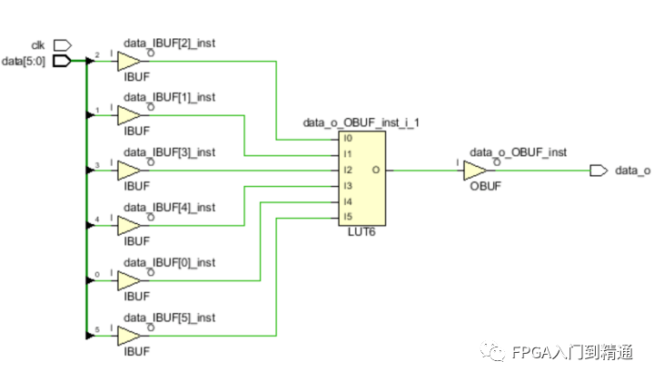

​	**2、如果逻辑表达式是5位以内输入1位输出，综合后的结果都是一个LUT5**

```verilog
module lut_test (
	input			clk		,
    input [5:0]		data	,
    output			data_o
);
    assign data_o = ((data[0]&data[1])^data[2]|data[3]&data[4]);
endmodule
```

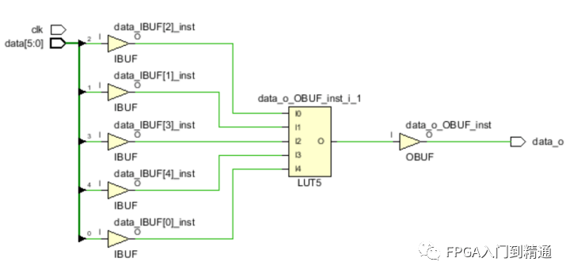

### MUX

​	以四选一数据选择器（MUX4_1）为例，MUX4_1表示有4位数据输入（D0-D3），有一位数据输出（Q），地址码则是用来选择输出

```verilog
module lut_test (
	input 			clk		,
    input [1:0]		addr	,
    input [3:0]		data	,
    output reg		data_o	
);
    always @(*) begin
        case(addr)
            2'd0: data_o = data[0];
            2'd1: data_o = data[1];
            2'd2: data_o = data[2];
            2'd3: data_o = data[3];
        endcase
    end
endmodule
```

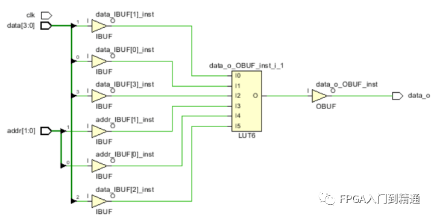

​	从图中可以看出，MUX4_1本质上还是一个LUT6，只不过它将2位地址输入和4位数据输入一起连接到LUT6的输入端

### 进位链

​	**1、半加器**

​	两个输入数据位（A、B）相加，输出一个结果位S和进位C，没有进位输入的加法器电路称为半加器

​	**2、全加器**

​	两个输入数据位（A、B）以及输入低位进位相加，输出一个结果位（S）和进位（C），称为全加器

​	**3、多位加法器**

​	最低位是半加器，或低位进位输入置零的全加器，再与全加器级联即可做成多为加法器

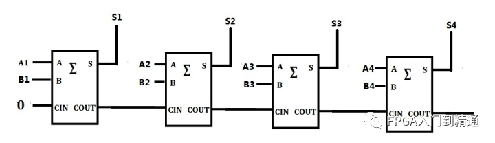

​	将第一个全加器的低位置1，其它3个全加器级联将称为4位减法器

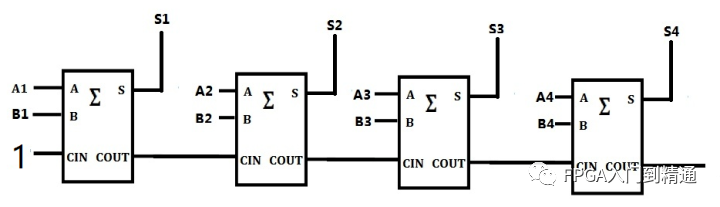

### 存储单元和CLB

​	**1、触发器**

​	通过检测时钟边沿（上升沿、下降沿）时，将输入给到输出。触发器是计算机记忆装置的基本单元，一个触发器能储存一位二进制代码，一个触发器可以组成一位的寄存器，多个触发器可以组成一个多位的寄存器

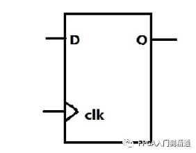

​	**2、锁存器**

​	通过检测使能信号电平（高电平、低电平）来改变存储的输出状态。锁存器因为不需要时钟，所以不是时序元件，它对毛刺无过滤功能，非常敏感，容易出问题，在很多情况下都是要避免使用的

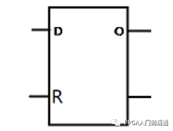

​	为了避免锁存器的产生，在**组合逻辑一定要将判断语句给完整**，如if语句必须要else、case语句加default，而**时序逻辑则不需要考虑**这个问题

​	**3、存储单元**

​	以Xlinx 7系列为例，主要存储单元是可编程逻辑块CLB，它有两个SLICE，每个SLICE都有8个存储单元。这个存储单元实际上是由4个触发器FF或锁存器组成）


​	如上图所示，左边的4个存储单元只能作为触发器使用，但右边的4个存储单元则可以作为触发器或者锁存器使用

### 内嵌RAM

​	FPGA的内嵌RAM块有Block RAM和Ultra RAM，可以灵活配置为ROM、单端口RAM、双端口RAM、伪双端口RAM、内容地址存储器CAM、FIFO等常用存储器结构

​	Xilinx常用的RAM块大小是4Kbit和18Kbit两种结构；lattice常用的RAM块大小是9Kbit；Altera常用的RAM块分别是M9KRAM（9Kbit），M-144K（144Kbit）

​	以Xilinx双端口IP为例，编译后如下图所示

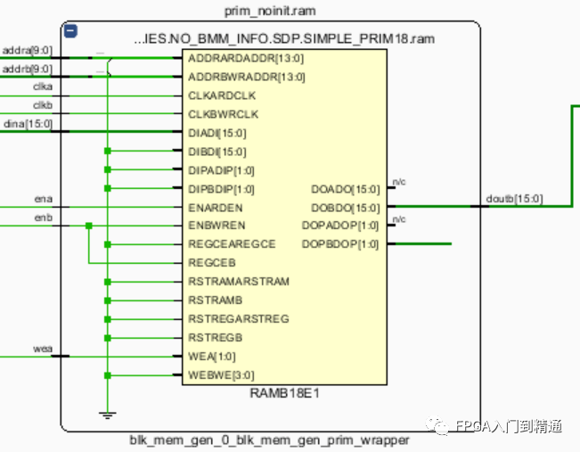

### DSP48E1

​	DSP48E1基本结构图如下：

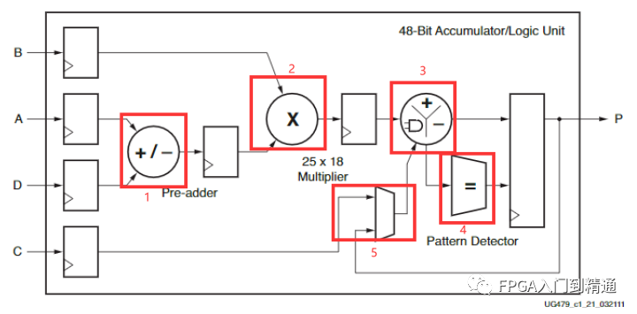

​	1、一个预加器（加法器），实现的是A（最大位宽30）与D（最大位宽是25）的相加，输出的结果最大位宽为25，该预加器不用的时候可以选择旁路掉

​	2、一个25×18乘法器，两个乘数分别为B（最大位宽18位），以及A与D相加后结果的低25位，输出的结果为48位（高5位是符号扩展位，低43位是数据位）

​	3、这个功能比较多，能做加（减）法器，累加（减）法器，逻辑运算（与或非），输出最大位宽为48位数据位+4位进位

​	4、一个模式探测器，主要实现带掩模的数据比较，上下溢出检测，计到一定数对结果进行重置功能

​	5、一个数据选择器，它的两个数据输入端分别为C和P（最大位宽48），可以决定DSP48E1做普通加法还是做累加功能

### 布线资源

​	布线资源类似绘制PCB时的连线资源，是为了能够让位于FPGA不同位置的逻辑资源块、时钟处理单元、Block RAM、DSP和接口模块等资源能够相互通信，从而协调合作，完成所需功能，连线的长度和工艺决定了信号在连线上的驱动能力和传输速度

​	主要有以下四种布线资源可供利用：
​	1、全局性的专用布线资源：用来完成器件内部的全局时钟和全局复位/置为的布线

​	2、长线资源：完成器件Bank间的一些高速信号和一些第二全局时钟信号的布线

​	3、短线资源：完成基本逻辑单元之间的逻辑互联和布线

​	4、其它资源：在基本逻辑单元内部还存在各式各样的布线资源和专用时钟、复位等控制信号线

### 底层嵌入功能单元

​	通过程度较高的嵌入功能模块，如PLL、DLL、DSP和CPU等

​	Intel/Altera芯片集成的是PLL，Xilinx芯片主要集成的是DLL，Lattice的新型FPGA同时集成了PLL与DLL以适应不同的需求

​	Intel/Altera芯片的PLL模块分为增强型PLL（EnhancedPLL）和快速PLL（FastPLL）

​	Xilinx芯片DLL的模块名称为CLKDLL，在高端FPGA中的CLKDLL的增强型模块为DCM（数字时钟管理模块）

​	PLL全称为Phase Locked Loop，即锁相环，本身是一种反馈控制电路，可以对时钟网络进行系统级管理、偏移控制，达到时钟倍频、分频、相位偏移和可编程占空比的效果

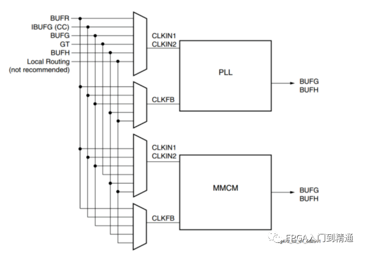

### 用户可编程I/O

​	用户可编程I/O（User I/Os，也被称为IOE），分布在整个芯片的四周，如下图所示：

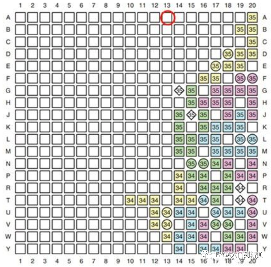

​	以Xilinx为例，通常Xilinx的功能命名格式为：IO_LXXY#或者IO_XX

​	**IO**：代表用户IO

​	**L**：代表差分，XX代表在当前BANK下的唯一标识号，Y=[P/N]表示LVDS信号的P或者N

​	**#**：表示bank号

​	如IO_L12P_T2_MRCC_12，表示这个是用户IO，差分信号，bank12的第13对差分的P端口，也是全局时钟网络输入管脚（MRCC是全局时钟网络）

​	除了FPGA的用户I/O外，还有很多其它功能的IO，如下载接口、模式选择接口、MRCC、电源引脚等等