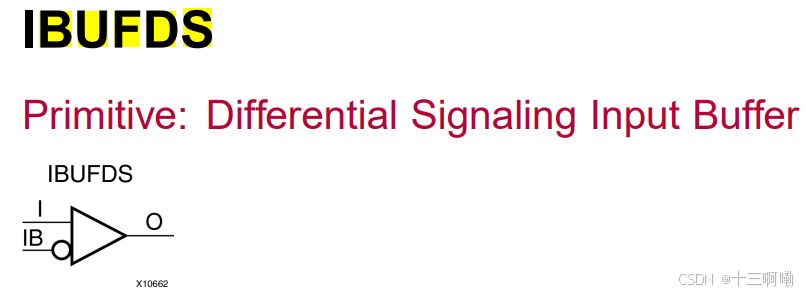
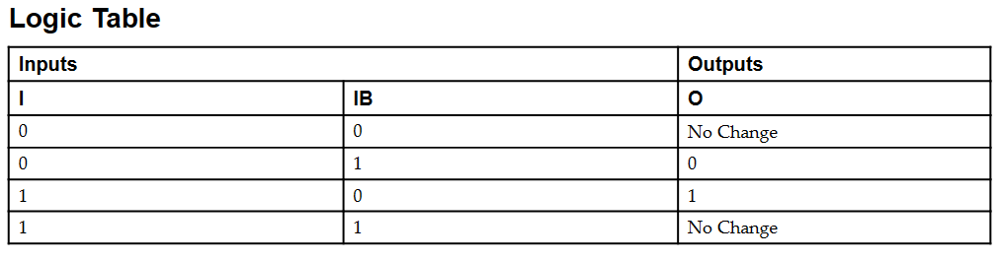
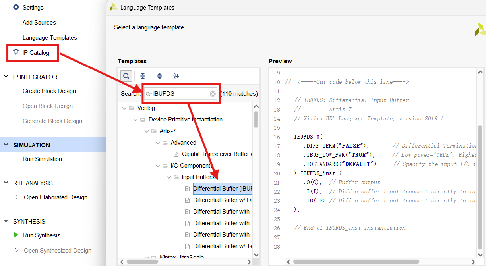

# 3. Verilog基础语法

### 模块

​		Verilog语法中最基本的元素就是模块，主要包括模块声明以及模块的内容，模块的声明结构如下：

```verilog
module Module_name(<端口信号列表>); // 注意这里要有分号
	<逻辑代码>
endmodule
```


### 输入输出

**input**：输入，对于一个模块的输入，应全声明为wire类型

**output**：输出，如果输出信号是在always语句块中赋值，则声明为output reg，如果用assign赋值，则声明为output即可

**inout**：输入和输出


### 数字进制格式

声明格式为：`<位宽><进制><数字>`

**二进制**：`1’b1`

**十进制**：`4’d8`

**十六进制**：`16‘hffff`


### 信号类型

#### 寄存器类型：reg

always块里操作的信号声明为reg，包括**`always @(posedge clk)`**和**`always @(*)`**，因此reg类型的信号不一定被综合为寄存器，也可能被综合为线网wire

#### 线网类型：wire

在一个模块例化时，其输入来自**其它模块输出**或者是**由assign赋值的组合逻辑**，输入声明为wire类型

信号的声明方法如下：

```verilog
reg [7:0] m [255:0]    // 定义了256个8位宽寄存器
```


### 参数类型

parameter和localparam不占用FPGA资源，直接连接到高低电平上

#### parameter

可以在module外部，在例化时进行修改

如一个模块的声明为：

```verilog
module test #(
    parameter p1 = 10;
    parameter p2 = 10;
)
(
    input clk,
    input rst
);
```

其可以通过下面代码在例化时对参数进行修改

```verilog
test #(
    .p1(5),
    .p2(15)
) inst1 (
    clk,
    rst
);
```

#### localparam

只能在module内部调用，不能被外部改变


### 运算符

#### 算数运算符

```text
加：+		// 加和减在位宽不是很大的情况下可以直接使用，如32位
减：-		// 如果位宽很大，应引入流水等额外处理
乘：*		// 只有在位宽很小时才可以直接用，位宽稍微大点都应用到乘法器	
除：/		// 只有在特定情境下可使用，如两个parameter类型或两个localparam，或除以2的			次幂，向下取整
取余：%    // 慎用
```

#### 关系运算符

```text
大于：			 >
小于：			 <
大于等于：		>=
小于等于：		<=
等于：			 ==
不等于：		!=
```

#### 逻辑运算符

```text
非：		!
与：		&&
或：		||
```

#### 位运算符

```verilog
非：		~
与：		&
或：		|
异或：		^
```

#### 条件运算符

```verilog
condition ? A : B
```

#### 移位运算符

```verilog
无符号移位运算：	<<	>>
算数移位运算：	<<<	>>>
```

#### 拼接运算符

```verilog
{}
例子：
	A = 2'b01
	B = 2'b10
	C = {A, B} = 4'b0110
```

#### 赋值运算符

**阻塞赋值立即生效，非阻塞赋值下一个时钟沿到来时生效**

##### 阻塞赋值：=

1、前一个赋值语句没有执行的话，后面赋值语句不会执行（**组合逻辑**）

2、顺序执行

3、`always @(*)`或`assign`

##### 非阻塞赋值：<=

1、时序逻辑

2、时序逻辑可以避免组合逻辑中竞争冒险的问题

3、并行执行


### 信号状态

#### 不定态：X

reg类型的信号没赋初值，其值不确定的状态

#### 高阻态：Z

wire类型的信号没有赋予初值


### 其它关键字

#### always @

语法非常简单，块内只有一条语句时，不需要使用`begin end`；块内有多条语句时，需要使用`begin end`包裹起来；推荐全部使用`begin end`包裹，以形成固定风格。

**组合逻辑语法**如下：

```verilog
always @(*) begin
    out = a&b&c&d;
end
```

对于always语句，括号内为敏感列表，一个个加入太麻烦，容易忘掉，用*代替敏感列表，编译器可以根据always块内部的内容自动识别敏感变量列表

**时序逻辑语法**如下：

```verilog
always@(posedge i_clk) begin
    if(i_rst) begin
        q <= 0;
    end
    else begin
        q <= d;
    end
end
```

在时序逻辑中，敏感列表一般为时钟边沿信号，时钟上升沿`posedge`或下降沿`negedge`；此外，若是异步复位，敏感列表中还会加上复位信号，如`always @(posedge clk or negedge rst_n)`

#### assign

wire类型的信号需要连续赋值，在Verilog中，这个概念是通过赋值语句assign来实现的；**reg类型的变量不能使用assign进行连续赋值**，这是因为reg类型的变量可以存储数据，并且不需要连续驱动；**只能在initial以及always块内对reg类型变量进行赋值**

代码示例如下：

```verilog
assign out = a&b&c&d;
```

####  begin end

组合逻辑多用阻塞赋值，此时使用`begin end`语句，将执行完一条语句后再执行下一条，即顺序执行；而时序逻辑多是并行执行，多用阻塞赋值，`begin end`语句只是相当于函数的花括号，将一段语句划分成块，但是块里语句依然是并行执行的。

当always块、initial块、条件语句（如`if, else if, 或者case`）后面等只有一条语句时，可以直接书写该语句而无需使用begin和end，然而，如果需要执行多条语句，则必须通过begin和end将这些语句组合成一个块状结构。

以条件语句为例，如果不使用begin和end并且有多条语句存在，那么只有第一条语句会被视为属于当前分支的一部分，而其余部分会称为外部代码的一部分，可能导致不符合预期结果。

```verilog
always @(posedge clk) 
    if (condition)
        a = 1;  
        b = 2; // 此行实际上不属于 'if' 块
```

以上面代码为例，仅当condition成立时才会设置`a=1`，但是无论条件真假都会无条件运行到下一句使`b=2`。

#### posedge和negedge

1、posedge是上升沿，电平从低到高跳变

2、negedge是下降沿，电平从高到低跳变

#### case default endcase

case语句检查给定表达式是否与列表中的其它表达是之一匹配并执行相应的分支语句，其通常用于实现多路复用器。如果有许多条件要检查，则`if-else`结构可能不适合，因为那可能综合到优先编码器而不是多路复用器。

`case`语句以`case`关键字开始，以`endcase`关键字结束。括号内的表达式只计算一次，其语法结构如下所示：

```verilog
case (<expression>)
    case_item1 :  <single statement>
    case_item2,
    case_item3 :  <single statement>
    case_item4 :  begin
                   <multiple statements>
                 end
    default    : <statement>
endcase
```

如果没有任何`case`项与给定表达式匹配，则执行`default`项中的语句。一个`case`语句中只能由一个`default`语句。case语句可以嵌套。

如果没有任何case与表达式匹配且没有给出默认语句，则退出case而不做任何事情。

`case`和`if-else`语句均要在`always`语句块中使用

#### if - else语句

两种情况：

```verilog
if（条件语句）begin
    ……
end else begin
    ……
end
```

多种情况：

```verilog
if（条件语句）begin
    ……
end else if（条件语句）begin
    ……
end else if（条件语句）begin
    ……
end else if（条件语句）begin
    ……
end
```

#### for

Verilog中for循环的每次循环是并行执行的，只是为了缩减代码量

**用法一**：寄存器初始化

initial在用于初始化寄存器这一情况时可以被综合，示例代码如下：

```verilog
reg [7:0] m [255:0];
integer i;
initial begin	// 可综合
    for (i = 0; i < 256; i = i + 1)
        m[i] = i;
end
```

**用法二**：同一模块多次例化

语法如下：

```verilog
genvar  i；	
generate 
        for(i;i<=10;i=i+1)begin:名字
				循环执行代码；
		end
endgenerate
```

1、需要定义循环索引，关键字为`genvar`，索引名字任取。索引可以定义在`generate`结构的内部或`generate`结构的外部。当定义在`generate`外部时，可以被多个`generate`使用，但是为了避免冲突，最好一个`generate`定义一个索引

2、`generate for`结构主体以generate关键字开始，以`endgenerate`关键字结束

3、主体为`for`循环结构，控制循环次数的信号，上面代码是10，只能是常量（`genvar、parameter和localparam`），保证只会生成一种电路

4、循环的主体，在begin后面最好命一个名字，否则可能会被编译器警告

以用四个一位半加器构成一个四位半加器的Verilog代码为例：

```verilog
module half_addr(
    input   a   ,
    input   b   ,
    output  bin ,
    output  sum
);
    assign sum = a^b;
    assign bin = a&b; 
endmodule

module generate_test_top(
    input   [3:0]   add_a,
    input   [3:0]   add_b,
    output  [3:0]   bin,
    output  [3:0]   sum
    );
    genvar i;
    generate
        for(i=0;i<4;i=i+1)begin:half_addr_f
             half_addr u_half_addr(
                    .a      (add_a[i]   ),
                    .b      (add_b[i]   ),
                    .bin    (bin[i]     ),
                    .sum    (sum[i]     )             
                    );
        end
    endgenerate  
endmodule
```

#### initial

一般用于仿真，除了给寄存器赋初值外不可综合；`initial`块可以理解为一个初始化块，在`initial`的起始位置的语句在0时刻就开始执行，之后如果遇到延时，则延时之后执行接下来的语句。其语法如下：

```verilog
// 单语句
initial
    [single statement]

// 多语句
initial begin
    [multiple statements]
end
```


### 系统函数和任务

#### $readmemh

`$readmemh`这一系统任务用来从指定文件中读取数据（以十六进制形式）到寄存器数组或者RAM、ROM中，除了可以在仿真的任何时刻被执行使用外，也可以用来对RAM或者ROM进行初始化（Vivado支持，其它开发工具可能不支持）。

数据文件的路径建议用绝对路径，用法示例如下：

```verilog
reg [7:0] o [15:0];

initial begin
    // 两个参数，第一个参数为文件路径，第二个参数为要初始化的寄存器
    $readmemh("E:/lesson7/data/data.txt", o);
end
```

#### $finish

`$finish`系统任务的作用是结束仿真过程

#### $random

`$random`系统函数提供了一个产生随机数的手段

`$random %b`给出了一个范围在`(-b+1 : b - 1)`的随机数


### 原语

#### IBUFDS

##### 功能

​	IBUFDS是一个支持低压差分信号的输入缓冲器，用于接收差分信号对（如LVDS），并将其转换为单端信号输出，可以用于时钟信号、数据总线信号等

​	IBUFDS接收两个差分信号（差分信号正输入I和差分信号负输入IB）作为输入，并将其转换为单端输出（单端输出信号O）

​	端口示意图如下：



​	其真值表如下：



##### 例化代码模板

​	打开Vivado左侧导航栏中的“Language Templates”，搜索IBUFDS，找到可直接调用的原语模块实例化代码



参数说明：

**DIFF_TERM**用于配置IBUFDS或其它差分输入缓冲器的差分终端

​	**“TRUE”：启用差分终端**。这会自动在差分输入端添加终端电阻，以减少信号噪声、反射并提高信号完整性。适用于需要高信号质量的应用场景

​	**“FALSE”：不启用差分终端**。默认情况下不会添加终端电阻，通常用于对信号质量要求不高的应用或外部电路已经处理了终端匹配的情况

**TERMIBUF_LOW_PWR**用于控制缓冲器的功耗模式

​	**“TRUE”：启用低功耗模式**。可以减少IBUFDS缓冲器的功耗，但低功耗模式通常会略微降低性能，但在大多数情况下，这种性能降低是微不足道的

​	**“FALSE”：启用最高性能模式**。选择这个选项会使IBUFDS缓冲器以最高的性能运行，但功耗会增加。这个模式适合对性能要求很高的应用场景

**IOSTANDARD**用于指定IBUFDS的输入/输出标准，IOSTANDARD决定了信号的电平标准、驱动能力和信号的电气特性

​	**“DEFAULT”：使用FPGA工具默认的I/O标准**。如果没有特定要求，可以使用默认值较为通用的标准

​	**特定标准**：根据实际应用需要，选择具体的I/O标准。具体的标准决定了电压电平和信号的兼容性

##### 应用示例

下面代码将差分输入时钟转为了单端时钟

```verilog
IBUFDS u1_IBUFDS (
    .O		(sys_clk)	,
    .I		(sys_clk_p)	,
    .IB		(sys_clk_n)
);
```

