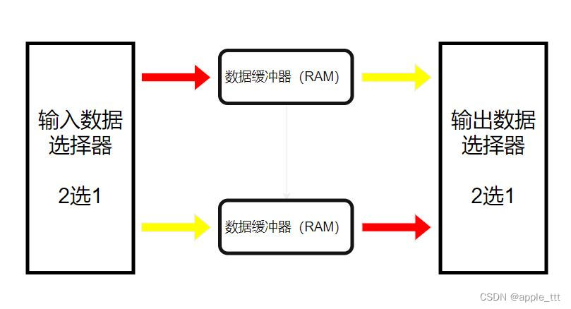

# FPGA乒乓操作

## 核心思想

​	将一个高速数据流分为两个或多个慢速数据流；如400M的数据流输入，可以用4个100M的模块分别处理，处理完成后再合在一起输出


## 基本原理

​	乒乓操作的基本原理非常简单，它使用两个并行的数据缓冲区，一个用于读取数据，另一个用于写入数据

​	当一个缓冲区满了后，立刻切换到另一个缓冲区进行读写操作，这样数据处理模块就可以连续不断地从缓冲区读取数据，同时将新的数据写入另一个缓冲区，实现数据地实时处理



​	具体步骤如下：

​	1、在第一个缓冲周期，输入数据流写入数据缓冲模块1，写完后进入第二个缓冲周期

​	2、在第二个缓冲周期，输入数据流写入数据缓冲模块2，同时将数据缓冲模块1中的数据读出

​	3、在第三个缓冲周期，输入数据流再次写入数据缓冲模块1，同时将数据缓冲模块2中的数据读出。这个过程会反复循环进行，即为乒乓操作

​	乒乓操作的缓冲区可以是双口BRAM、也可以是DDR中的内存


## 代码实现

```verilog
module pp_fifo(
	input			wr_clk		,
	input			rd_clk		,
	input			rst_n		,
					
	input			data_de		,
	input	[15:0]	data 		,
	
	output			data_de0	,
	output	[15:0]	data0		,	
	
	output			data_de1	,
	output	[15:0]	data1			
);

	reg	 [15:0]	cnt			 	;
		
	reg	 		pp_switch	 	;	
		
	reg	 		wr_en0		 	;	
	reg	 [15:0] din0			;
	reg			rd_en0			;	
	wire [15:0]	dout0			;		
	wire		full0			;
	wire		empty0		    ;
	wire [9:0] 	rd_data_count0	;
	wire [9:0] 	wr_data_count0	;

	reg	 [7:0]	rd_cnt0			;

	reg	 		wr_en1		 	;	
	reg	 [15:0] din1			;
	reg			rd_en1			;	
	wire [15:0]	dout1			;
	wire		full1			;
	wire		empty1		    ;
	wire [9:0] 	rd_data_count1	;
	wire [9:0] 	wr_data_count1	;

	reg	 [7:0]	rd_cnt1			;

	always@(posedge wr_clk)
		if(!rst_n)
			cnt <= 0;
		else if(cnt==65535)
			cnt <= 0;
		else if(data_de==1'b1)
			cnt <= cnt + 1'b1;
		else
			cnt <= cnt;

	always@(posedge wr_clk)
		if(!rst_n)
			pp_switch <= 1'b0;
		else if(cnt[7:0]==255)//255 511 767 1023 ....
			pp_switch <= ~pp_switch;
		else
			pp_switch <= pp_switch;


	always@(posedge wr_clk)
		if(!rst_n)
			wr_en0 <= 1'b0;
		else if(data_de==1'b1&&pp_switch==1'b0)
			wr_en0 <= 1'b1;
		else
			wr_en0 <= 1'b0;

	always@(posedge wr_clk)
		if(!rst_n)
			din0 <= 0;
		else if(data_de==1'b1&&pp_switch==1'b0)
			din0 <= data;
		else
			din0 <= 0;

	always@(posedge wr_clk)
		if(!rst_n)
			wr_en1 <= 1'b0;
		else if(data_de==1'b1&&pp_switch==1'b1)
			wr_en1 <= 1'b1;
		else
			wr_en1 <= 1'b0;

	always@(posedge wr_clk)
		if(!rst_n)
			din1 <= 0;
		else if(data_de==1'b1&&pp_switch==1'b1)
			din1 <= data;
		else
			din1 <= 0;

	always@(posedge rd_clk)
		if(!rst_n)
			rd_en0 <= 1'b0;
		else if(rd_cnt0==255)
			rd_en0 <= 1'b0;
		else if(rd_data_count0>=256)
			rd_en0 <= 1'b1;
		else
			rd_en0 <= rd_en0;

	always@(posedge rd_clk)
		if(!rst_n)
			rd_cnt0 <= 0;
		else if(rd_cnt0==255)
			rd_cnt0 <= 0;
		else if(rd_en0==1'b1)
			rd_cnt0 <= rd_cnt0 + 1'b1;
		else
			rd_cnt0 <= rd_cnt0;
			
	always@(posedge rd_clk)
		if(!rst_n)
			rd_en1 <= 1'b0;
		else if(rd_cnt1==255)
			rd_en1 <= 1'b0;
		else if(rd_data_count1>=256)
			rd_en1 <= 1'b1;
		else
			rd_en1 <= rd_en1;

	always@(posedge rd_clk)
		if(!rst_n)
			rd_cnt1 <= 0;
		else if(rd_cnt1==255)
			rd_cnt1 <= 0;
		else if(rd_en1==1'b1)
			rd_cnt1 <= rd_cnt1 + 1'b1;
		else
			rd_cnt1 <= rd_cnt1;		

	fifo_ch0 u1_fifo_ch0 (
	  .wr_clk			(wr_clk			),	
	  .rd_clk			(rd_clk			),	
	  .din				(din0			),	
	  .wr_en			(wr_en0			),	
	  .rd_en			(rd_en0			),	
	  .dout				(dout0			),	
	  .full				(full0			),	
	  .empty			(empty0			),	
	  .rd_data_count	(rd_data_count0	),	
	  .wr_data_count	(wr_data_count0	) 	
	);	

	fifo_ch0 u2_fifo_ch0 (
	  .wr_clk			(wr_clk			),	
	  .rd_clk			(rd_clk			),	
	  .din				(din1			),	
	  .wr_en			(wr_en1			),	
	  .rd_en			(rd_en1			),	
	  .dout				(dout1			),	
	  .full				(full1			),	
	  .empty			(empty1			),	
	  .rd_data_count	(rd_data_count1	),	
	  .wr_data_count	(wr_data_count1	) 	
	);	

	assign data_de0		=   rd_en0	;
	assign data0		=   dout0	;

	assign data_de1		=   rd_en1	;
	assign data1		=   dout1	;	

endmodule

```

