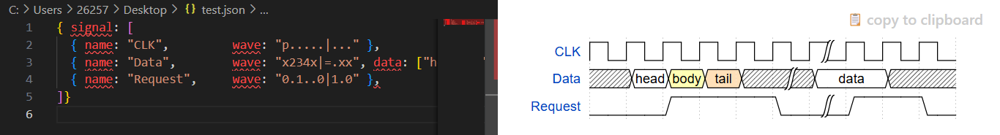

# 1. VScode设置

## 常用设置

### 语言显示设置

​	VScode默认英文语言环境，可以将VScode设置成中文语言环境

​	1）打开VScode软件，按快捷键`Ctrl + shift + P`或`F1`

​	2）在弹出的搜索框中输入`configure language`，然后选择`Configure Display Language`

​	3）在选择框中选择想要的语言

​	4）重启Vscode后界面就变成了选择的语言

### 自动识别文件内容编码

​	打开设置，搜索`auto guess encoding`并勾选上

### 文件对比功能

​	只要在左侧，按下ctrl键，鼠标选中两个文件，再点击鼠标右键，选择“将已选项进行比较即可”

### 多窗口显示文件

​	如果需要同时显示多个文件，可在打开文件后，右击，选择“向上拆分”、“向下拆分”、“向左拆分”或“向右拆分”

## 常用插件

### Verilog HDL插件

​	输入“Verilog HDL”搜索，选择“Verilog HDL/SystemVerilog/Bluespec”插件，点击安装即可

### TCL language Support

​	支持约束文件的语法高亮

### Waveform Render

​	可以在vscode中写一些代码实时生成对应的时序图

​	应用示例：

## 代码自动补全与实时纠错

​	**1、将Vivado目录下的xvlog路径添加到系统环境变量中**

​	**2、用快捷键“ctrl+,”，打开VScode的设置，选择xvlog**

​	**3、重启VScode**

## 实例化模块与定义的跳转

​	**1、下载网盘中的ctags**

​	**2、将下载ctags文件解压缩到C盘，并将ctags.exe所在文件夹设置到系统环境变量中，类似xvlog**

​	**3、用快捷键“ctrl+,”，打开VScode设置，填入ctags**

​	注：只有以文件夹形式打开，ctags才生效

