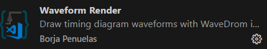
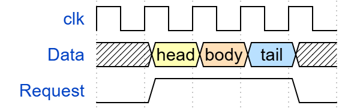
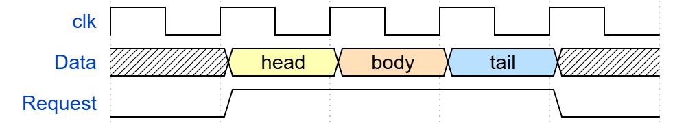
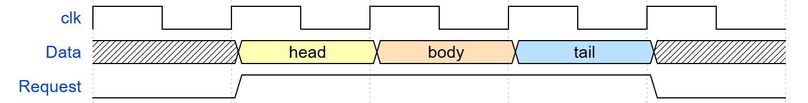
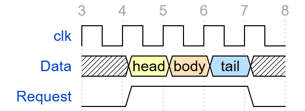
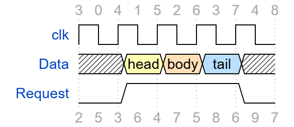
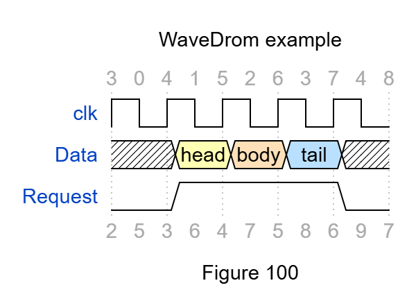
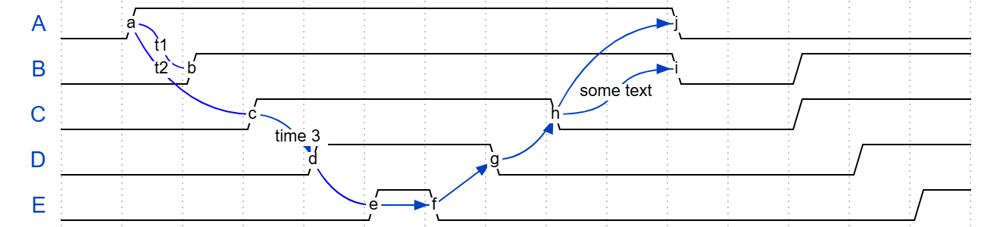
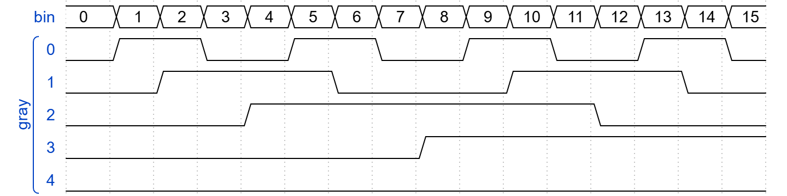

# 2. WaveformRender使用

## WaveDrom插件介绍

​	在VScode应用商店中搜索Waveform Render，这个就相当于WaveDrom了



​	左边键入代码，右边会自动生成时序图

​	第一次打开时，先按`”ctrl+K”`，再按`“ctrl+D”`才能自动生成时序图；先按`“ctrl+K”`，再按`“ctrl+L”`能够实时刷新


## WaveDrom的基本使用

### 基本结构

​	先看看实例代码：

```json
{signal:[
    {name: 'clk', wave: 'p.....|...'},
    {name: 'dat', wave: 'x.345x|=.x', data: ['head', 'body', 'tail', 'data']},
    {name: 'req', wave: '0.1..0|1.0'},
    {},
    {name: 'ack', wave: '1.....|01.'}
]}
```

​	生成的波形图为：


​	从示例代码可以看出，波形描述语言的总体框架如下：

```json
{signal:[
    
]}
```

​	在两个中括号里面填充需要描述的波形，一般波形描述如下：

```json
{signal:[
    {name: 'clk', wave: 'p.....|...'},
    
]}
```

​	每个波形的描述都在一个大括号`{}`内，如果不是最后一个波形描述，大括号的结尾还有一个逗号；name信号的名字，wave信号的特征

​	上面例子中wave: ‘p…’其中p代表一个时钟周期，其中的点是重复的意思，有几个点就重复几次，’|‘表示省略了一系列时钟，没画出来

​	其中wave所对应的字符串每个字符对应一个信号值，常用的字符值有：

```text
p - when first in string creates positive edged clock wave
n - when first in string creates negative edged clock wave
P - same as p but with arrow
N - same as n but with arrow
0 - low level
1 - high level
= - value default color 2
2 - value with color 2
3 - value with color 3
4 - value with color 4
5 - value with color 5
x - undefined value
. - extends previous cycle
z - hign impedance state
u - pull up(weak 1)
d - pull down(weak 0)
| - extends previous cycle and draw gap on the top of it
```

### 示例

​	**例1**

```json
{signal:[
    {name: 'plck', wave: 'p'},
    {name: 'Plck', wave: 'P'},
    {name: 'nlck', wave: 'n'},
    {name: 'Nlck', wave: 'N'}
]}
```


​	**例2**

```json
{signal:[
    {name: 'hclk', wave: 'hL'},
    {name: 'Hclk', wave: 'Hl'},
    {name: 'lclk', wave: 'lH'},
    {name: 'Llck', wave: 'Lh'},
    {name: 'clk1', wave: '01010'},
    {name: 'clk2', wave: 'xhlHLx'}
]}
```


​	**例3**

​	2、3、4、5、=是填充符，就是依次填充data里面的数据

​	除了0和1这两个数字，其它数字都各表示一种颜色

```json
{signal:[
    {name: "clk", wave: "P......"},
    {name: "bus", wave: "x.23.=x", data: ['head', 'body', 'tail']},
    {name: "wire", wave: "0.1..0."}
]}
```


​	**例4**

​	波道可以联合在以数组形式命名组中。`[‘组名’, {.}, {.}]`数组的第一个条目是组的名称，可以嵌套组

​	`{}`表示空出一行

```json
{ signal: [
 {    name: 'clk',   wave: 'p..Pp..P'},
 ['Master',
   ['ctrl',
     {name: 'write', wave: '01.0....'},
     {name: 'read',  wave: '0...1..0'}
   ],
   {  name: 'addr',  wave: 'x3.x4..x', data: 'A1 A2'},
   {  name: 'wdata', wave: 'x3.x....', data: 'D1'   },
 ],
 {},
 ['Slave',
   ['ctrl',
     {name: 'ack',   wave: 'x01x0.1x'},
   ],
   {  name: 'rdata', wave: 'x.....4x', data: 'Q2'},
 ]
]}
```


​	**例5**

​	period：周期

​	phase：相位

```json
{signal:[
 {name:"CLK",wave:"p........",period:2},		
 {name:"CLK_Mul",wave:"p........",period:1},
 {name:"CLK_Mul_Inv",wave:"p........",period:1, phase:0.5},
 {name:"CLK_90",wave:"p........",period:2, phase:-0.5}, 		
]}
```


## WaveDrom的进阶使用

### Config:{.}属性控制不同方面的渲染

#### hscale

​	控制图表的水平比例，用户可以输入任何大于0的整数

```json
{ signal: [
 { name: "clk",     wave: "p...." },
 { name: "Data",    wave: "x345x",  data: ["head", "body", "tail"] },
 { name: "Request", wave: "01..0" }
 ],
 config: { hscale: 1 }
}
```

​	**hscale = 1（默认）**



​	**hscale = 2**



​	**hscale = 3**



#### skin（布局）

​	选择WaveDrom布局，该属性仅对页面上的第一个时序图内起作用

​	WaveDrom包括两个标准：“默认”和“窄”（‘default’ and ‘narrow’）

```json
{ signal: [
 { name: "clk",     wave: "p...." },
 { name: "Data",    wave: "x345x",  data: ["head", "body", "tail"] },
 { name: "Request", wave: "01..0" }
 ],
config: {skin:'default'}
}
```


```json
{ signal: [
 { name: "clk",     wave: "p...." },
 { name: "Data",    wave: "x345x",  data: ["head", "body", "tail"] },
 { name: "Request", wave: "01..0" }
 ],
config: {skin:'narrow'}
}
```


#### head/foot添加文字内容描述

​	head和foot属性定义了时序图上方和下方的区域内容

##### tick

​	tick添加与垂直标记对齐的时间线标签

```json
{ signal: [
 { name: "clk",     wave: "p...." },
 { name: "Data",    wave: "x345x",  data: ["head", "body", "tail"] },
 { name: "Request", wave: "01..0" }
 ],
config: {skin:'default'},
head:{tick:3}
}
```



##### tock

​	tock在垂直标记（tick）之间添加时间线标签

```json
{ signal: [
 { name: "clk",     wave: "p...." },
 { name: "Data",    wave: "x345x",  data: ["head", "body", "tail"] },
 { name: "Request", wave: "01..0" }
 ],
config: {skin:'default'},
head:{tick:3,tock:0}
}
```


```json
{ signal: [
 { name: "clk",     wave: "p...." },
 { name: "Data",    wave: "x345x",  data: ["head", "body", "tail"] },
 { name: "Request", wave: "01..0" }
 ],
config: {skin:'default'},
head:{tick:3,tock:0},
foot:{tick:2,tock:5}
}
```



##### text

​	text添加标题/标题文本

```json
{ signal: [
 { name: "clk",     wave: "p...." },
 { name: "Data",    wave: "x345x",  data: ["head", "body", "tail"] },
 { name: "Request", wave: "01..0" }
 ],
config: {skin:'default'},
head:{text:'WaveDrom example',tick:3,tock:0},
foot:{text:'Figure 100',tick:2,tock:5}
}
```



##### every

​	每N个周期tick和tock作用一次

##### 文本属性

​	head/foot文本具有SVG文本的所有属性。标准SVG tspan属性可用于修改文本的默认属性。用于表示SVG文本内容的JsonML标记语言。可以使用几种预定义的样式并混合使用：

​	h1 h2 h3 h4 h5 h6 —— 预定义字体大小

​	muted warning error info success —— 字体颜色样式

​	其它SVG tspan属性可以在自由式中使用，如下所示：

```json
{signal: [
{name:'clk', wave: 'p.....PPPPp....' },
{name:'dat', wave: 'x....2345x.....', data: 'a b c d' },
{name:'req', wave: '0....1...0.....' } 
],
head:{text:
 ['tspan',
  ['tspan', {class:'error h1'}, 'error '],
 	['tspan', {class:'warning h2'}, 'warning '],
  ['tspan', {class:'info h3'}, 'info '],
  ['tspan', {class:'success h4'}, 'success '],
  ['tspan', {class:'muted h5'}, 'muted '],
  ['tspan', {class:'h6'}, 'h6 '],
  'default ',
  ['tspan', {fill:'pink', 'font-weight':'bold', 'font-style':'italic'}, 'pink-bold-italic']
 ]
},
foot:{text:
['tspan', 'E=mc',
   ['tspan', {dy:'-5'}, '2'],
['tspan', {dy: '5'}, '. '],
['tspan', {'font-size':'25'}, 'B '],
['tspan', {'text-decoration':'overline'},'over '],
['tspan', {'text-decoration':'underline'},'under '],
['tspan', {'baseline-shift':'sub'}, 'sub '],
['tspan', {'baseline-shift':'super'}, 'super ']
],
     tock:-5
}
}
```


### 箭头

#### Splines

```json
{ signal: [
 { name: 'A', wave: '01........0....',  node: '.a........j' },
 { name: 'B', wave: '0.1.......0.1..',  node: '..b.......i' },
 { name: 'C', wave: '0..1....0...1..',  node: '...c....h..' },
 { name: 'D', wave: '0...1..0.....1.',  node: '....d..g...' },
 { name: 'E', wave: '0....10.......1',  node: '.....ef....' }
 ],
 edge: [
   'a~b t1', 'c-~a t2', 'c-~>d time 3', 'd~-e',
   'e~>f', 'f->g', 'g-~>h', 'h~>i some text', 'h~->j'
 ]
}
```



#### Sharp line

```json
{ signal: [
{ name: 'A', wave: '01..0..',  node: '.a..e..' },
{ name: 'B', wave: '0.1..0.',  node: '..b..d.', phase:0.5 },
{ name: 'C', wave: '0..1..0',  node: '...c..f' },
{                              node: '...g..h' }
],
edge: [
  'b-|a t1', 'a-|c t2', 'b-|-c t3', 'c-|->e t4', 'e-|>f more text',
  'e|->d t6', 'c-g', 'f-h', 'g<->h 3 ms'
]
}
```


### 嵌入代码块

```json
(function (bits, ticks) {
 var i, t, gray, state, data = [], arr = [];
 for (i = 0; i < bits; i++) {
   arr.push({name: i + '', wave: ''});
   state = 1;
   for (t = 0; t < ticks; t++) {
     data.push(t + '');
     gray = (((t >> 1) ^ t) >> i) & 1;
     arr[i].wave += (gray === state) ? '.' : gray + '';
     state = gray;
   }
 }
 arr.unshift('gray');
 return {signal: [
   {name: 'bin', wave: '='.repeat(ticks), data: data}, arr
 ]};
})(5, 16)
```

