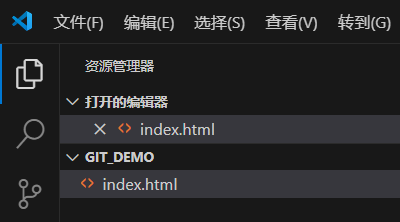

# 3. VScode和git联合使用

## git安装与配置

​	打开VScode，点击最右侧源代码管理，点击下载适用于Windows的Git


​	在跳转出来的网站中下载对应版本的git


​	安装完成git验证方法，重启VScode，再次点击最右侧源代码管理，发现已经变成打开文件夹和克隆仓库


​	或者打开VScode的中断（也可以cmd），输入`git –version`，跳出git的版本号，说明git成功安装

​	通过git配置用户名和邮箱地址

```powershell
git config --global user,name "Liyb65"
git config --global user.email 2625715894@qq.com
```


## git本地提交

​	打开一个文件夹



​	点击右侧源代码管理，点击初始化仓库

​	在消息中输入本次提交的名字，点击提交，并在弹出的窗口点击“始终”


​	在右下角的图形中，就可以看到我们提交的次数，以及每次提交之间的关系


​	对代码进行修改后可以看到右侧代码管理处出现一个1，表示有修改并未提交


​	第二次提交也进入了图形中


​	可以很容易的比较出，本次提交相较于前面的提交做了哪些修改


## github远程提交

​	在第一次发布分支时，会弹出下面窗口


​	要保证浏览器登录着GitHub，且保持登录状态，同时登录Github的浏览器为默认浏览器，再点击确认后，浏览器跳转到下面界面


​	点击continue


​	点击Authorize Visual-Studio-Code即可

​	回到VScode上方正中央出现两个选项


​	Private对应私人仓库，public对应公开仓库；前者需要密码或要求才能看到，另一个直接看到

​	**window凭据不正确可能会导致无法正确识别，从而导致权限出错**

​	**安装git history插件可以查看提交记录**