# 4. Git使用

## Git的使用方式

​	1、命令行

​	2、图形化界面（GUI）

​	3、IDE插件/扩展

​	git中所有命令都以git开头


## Git配置

### 1）配置用户名和邮箱

```powershell
git config --global user,name "Liyb65"
git config --global user.email 2625715894@qq.com
```

​	省略（Local）：本地配置，只对当前的git仓库有效

​	`--global`：全局配置，所有仓库有效

​	`--system`：系统配置，对所有用户有效

​	用户名和邮箱存在空格，就必须用双引号括起来；如果没有，则可以省略

​	该配置只用执行一次，如果之前配置过，则该步骤可以省略

​	还可以设置一个全局的Git配置，告诉Git在需要身份验证时使用store凭证助手，不用每次都输入账户密码

```powershell
git config --global credential.helper store
```

### 2）查看配置信息

```powershell
git config --global --list
```


## 新建仓库

​	版本库又叫仓库，英文名叫Respository，简称Repo

​	可以把仓库理解成一个目录，目录中的所有文件都能被Git管理起来，每个文件的修改、删除、添加等操作，Git都能跟踪到，以便任何时候都能追踪历史或者还原到之前的某一个版本

​	创建一个仓库非常简单，只要把一个目录变成Git可以管理的仓库即可

### 方法一：git init

​	在自己电脑本地直接创建一个仓库，以下面命令（Git Bash中输入）为例：
```powershell
# 在当前目录下创建一个名为learn-git的目录
mkdir learn-git
# 跳转到learn-git目录
cd learn-git
# 初始化仓库
git init
```

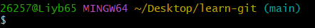

​	可以看到`git init`命令执行后，文件夹后面多了一个main，这个main就是当前所在分支的名称，表示当前这个目录已经是一个被Git管理的仓库

​	使用下面命令可以看到`.git`这一隐藏目录

```powershell
ls -a	# 直接输入ls看不到隐藏目录
```

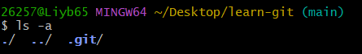

​	通过下面命令跳转到`.git`目录下

```powershell
cd .git
```

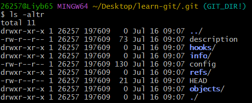

​	可以看到组成git仓库的文件和目录，不能随意删除或修改这些文件的内容，否则会破坏git仓库，这也是该文件夹被隐藏的原因，比如通过下面命令删除掉git目录，那该仓库也会被删除掉

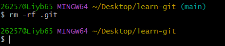

​	可以看到在删除掉git目录后，main分支已经消失，变为一个普通的文件目录

​	`git init`后面还可以指定目录的名称，如果指定了就会在当前目录下面创建一个新的目录作为git仓库，创建一个名为my-repo的git仓库命令如下：

```powershell
git init my-repo
```

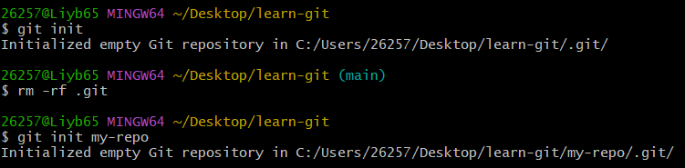

​	可以看到执行`git init`命令，是在learn-git目录下生成的.git目录，加上参数后就是在learn-git后面的my-repo里面生成一个.git目录，也就是my-repo才是我们创建的仓库

​	可以看到目前my-repo仓库处于main分支

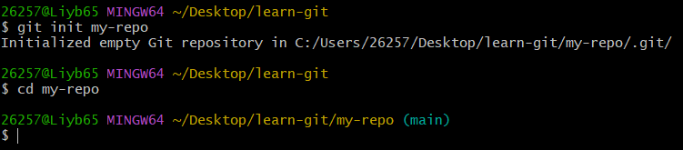

### 方法二：git clone

​	从远程服务器上克隆一个已经存在的仓库，通过https进行仓库克隆的示例命令如下：

```powershell
 git clone https://github.com/quanzaihh/Neural-Network-Accelerator.git
```


​	可以看到克隆完毕后，再当前目录下，除了之前创建的my-repo目录，还多了一个我们克隆来的Neural-Network-Accelerator目录


​	同时，该目录也处于main分支


## 工作区域和文件状态

​	git的本地数据管理分为三个区域，分别是工作区、暂存区和本地仓库

​	**工作区（Working Directory）**：也叫工作目录或者本地工作目录，在资源管理器中能看到的文件夹就是工作区

​	**暂存区（Staging Area/Index）**：临时存储区域，用于保存即将提交到Git仓库的修改内容，暂存区域是Git进行版本控制时非常重要的一个区域，暂存区中的内容提交到仓库后，暂存区中的内容还在

​	**本地仓库**：通过`git init`或者`git clone`命令创建的仓库，包含了完整的项目历史和元数据，是Git存储代码和版本信息的主要位置

​	简单来说，工作区就是我们实际操作的目录；暂存区就是一个中间区域，用于临时存放即将提交的修改内容；本地仓库就是Git存储代码和版本信息的主要位置

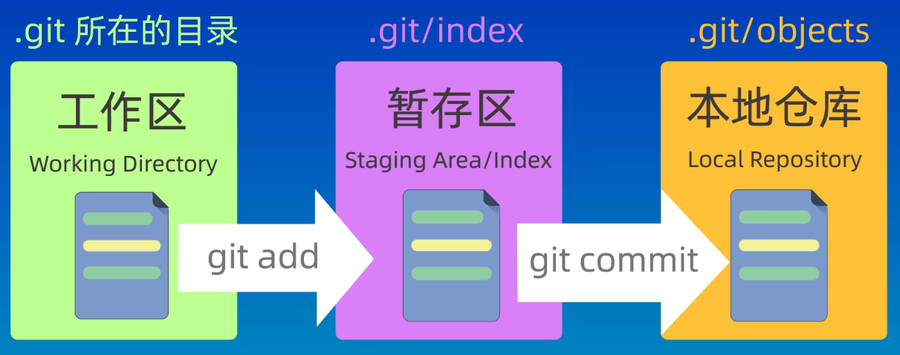

​	当修改完工作区的文件之后，需要将它们添加到暂存区，再将暂存区的修改提交到本地仓库中；该过程中我们可以使用Git提供的命令来查看、比较或者撤销修改内容，来保证版本控制的准确性和完整性

​	不是每一次修改都需要提交，暂存区可以存多次修改，然后将多次一次性提交到本地仓库中

​	相应的，Git中的文件也存在几种状态：未跟踪、未修改、已修改、已暂存、已提交

​	**未跟踪**：新创建的，没被Git管理起来的文件

​	**未修改**：已经被Git管理起来，但是文件内容没有发生变化，还没被修改过

​	**已修改**：被修改后的文件，但是还没被添加到暂存区里面

​	**已暂存**：修改后，并已经添加到了暂存区域的文件


## 添加和提交文件

​	涉及到的命令如下：

```powershell
git init		# 创建仓库
git status		# 查看仓库的状态
git add			# 添加到缓存区
git commit		# 提交
git log			# 查看提交记录
git ls-files	# 查看已被跟踪的文件
```

### git status


​	没对文件夹做任何改变时显示如上

### git add和git commit

​	利用echo生成一个txt文件

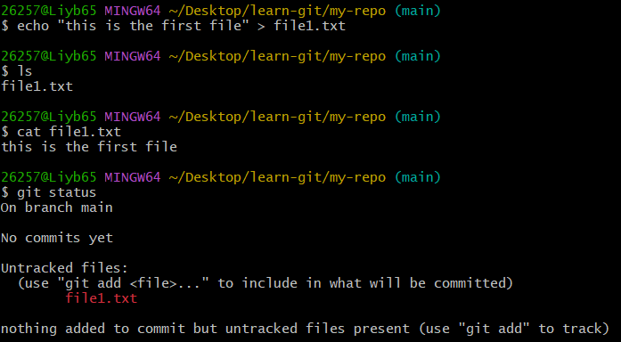

​	可以看到新添加的文件处于未被跟踪的状态，利用`git add file1.txt`指令将文件添加到暂存区


​	可以看到红色的file1.txt已经变成了绿色，表示这个文件已经被添加到了暂存区，等待被提交；还可以使用`git rm –cached <file>`这一命令将添加到暂存区的文件再取消暂存

​	再利用git commit指令将暂存区中的文件提交到仓库中，我们的文件只有被提交到仓库中，才算真正的被保管起来；**git commit这个命令只会提交暂存区中的文件，而不会提交工作区中的其它文件**

​	如我们再利用echo创建一个文件，并利用git status查看仓库状态


​	可以看到因为第二个文件没有`git add`，所以第二个处于未跟踪的状态

​	`git commit`这个命令在提交的时候需要使用`-m`参数指定提交的信息，该信息会被记录到仓库中，如果不指定该参数，就会进入一个交互式的界面，默认使用vim来编辑提交信息


​	可以看到前面绿色的file1.txt已经不见了，因为file1已经被提交到仓库里保管起来，而没在暂存区中的file2.txt并没有被提交到仓库中

​	**`git add`命令还可以使用通配符来添加多个文件**

​	再次使用echo添加多个文件——“file3.txt”，“file4.txt”，“file5.sh”


​	可以看到文件夹中有4个txt结尾的文本文件，1个sh结尾的脚本文件；同时通过`git status`命令可以看到除了file1已经被仓库保管起来之外，四个新建的文件都处于一个未跟踪的状态

​	可以使用`git add *.txt`将所有txt结尾的文件都添加到暂存区


​	查看仓库状态可以看到以txt结尾的三个文件都已经被添加到了暂存区，而file5.sh这个文件因为不是以txt结尾，所以没有被添加到暂存区里面

​	除了通配符以外，git add命令还可以接受文件夹作为参数，比如想要添加所有文件的话，可以使用`git add .`这个命令来把当前文件夹下的，这里的点表示当前目录


​	可以看到当前文件夹下的所有文件都已经被添加到了暂存区

### git log

​	进行第二次提交，并用`git log`命令查看提交信息


​	**`git log`命令可以使用`--oneline`参数来查看简介的提交记录**

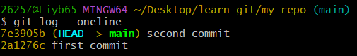


## git reset回退版本

​	日常开发时，经常需要撤销一些之前的修改内容，或者回退到之前的某一个版本；`git reset`命令可以退回到之前的某一个提交的状态

### git reset的三种模式

​	git reset后面可以加上三种不同类型的参数，分别是soft、hard和mixed

​	**`git reset --soft`**：回退到某一个版本，并且保留两个版本间工作区和暂存区的所有修改内容

​	**`git reset --hard`**：回退到某一个版本，并且丢弃两个版本间工作区和暂存区的所有修改内容

​	**`git reset --mixed`**：回退到某一个版本，并且只保留两个版本间工作区的修改内容，而丢弃暂存区的修改内容

​	mixed是reset命令的默认参数

​	新建一个仓库，并添加几次提交内容


​	可以在git log中看到三次提交历史

​	这时如果想要回退到上一个版本时，就可以使用git reset命令

​	把仓库目录复制三份，分别执行三种不同的参数


​	还可以发现复制并不会导致版本ID变更


#### soft参数

​	首先看一下soft参数，直接在命令行输入`git reset --soft`，后面加上要回退的版本ID就可以了，即`git reset --soft c10fdff`

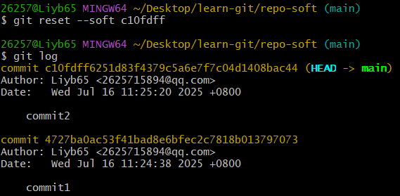

​	可以看到回退之后，提交历史就只有两次了，HEAD指针也指向了第二个版本

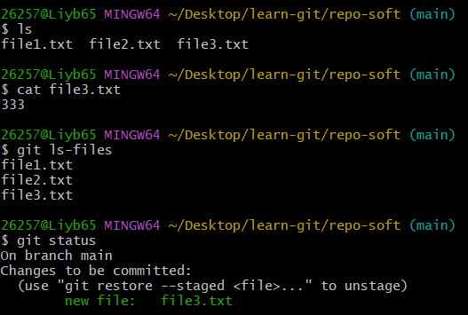

​	使用`ls`命令查看工作区内容，可以看到files3这个文件还在，`cat file3.txt`查看一下file3中的内容也是没问题的；`git ls-files`再用查看一下被跟踪的文件和用`git status`命令查看一下仓库状态，可以看到file3是被跟踪且在暂存区中的

​	soft模式，回退到上一个版本的时候，工作区和暂存区的内容都不会被清空，所以file3这一文件还存在，但是因为我们回退到了第二个版本，而file3是第三个版本才添加的，所以对于第二个版本来说，file3是一个新文件，重新添加暂存和提交即可

#### hard参数

​	谨慎使用

​	使用`git reset --hard HEAD^`命令也可以回到上一个版本，这次使用HEAD加上尖角号来表示上一个版本 

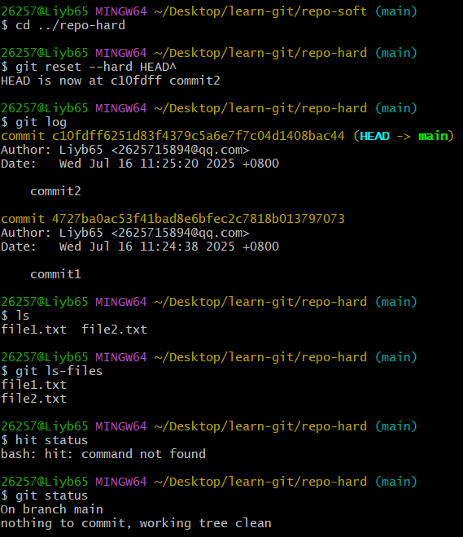

​	可以看到用hard参数回退后，提交历史也是只有两次了

​	同时可以看到工作区中file3文件已经不存在了，同时在暂存区中也没有file3这个文件

​	即用hard参数回退到前面版本，工作区和暂存区的内容都会被清空，即在第二次commit后的所有操作都被删除干净了

#### mixed参数


​	可以看到提交历史也是只有两次，file3这文件还是存在且其中内容没有问题，但是暂存区中没有file3这一文件，file3回到了未跟踪的状态

#### 误操作

​	如果不小心误操作的话，也无需担心，Git中的所有操作都是可以回溯的，可以使用`git reflog`命令来查看一下我们操作的历史记录，然后找到误操作之前的版本号，再使用git reset命令回到该版本即可

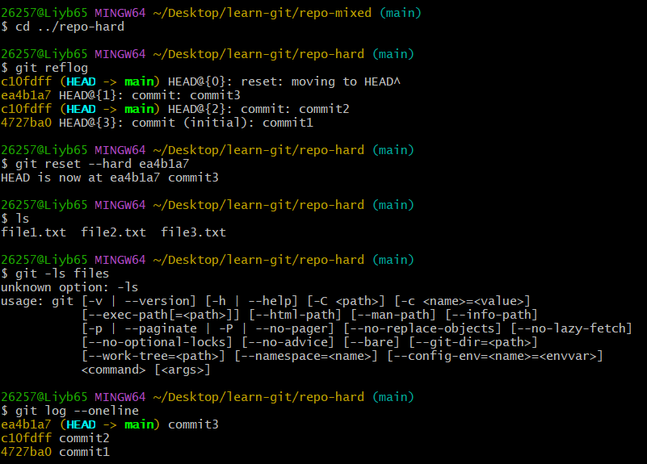

​	可以看到又回到了第三次提交那个版本


## git diff

### 功能

​	可以用来查看文件在工作区、暂存区以及版本库之间的差异

​	还可以查看文件在两个特定版本之间的差异

​	或者文件在两个分支之间的差异

### 使用

| 命令                                                         | 功能                        |
| ------------------------------------------------------------ | --------------------------- |
| `git diff`                                                   | 工作区 VS 暂存区            |
| `git diff HEAD`                                              | 工作区 + 暂存区 VS 本地仓库 |
| `git diff --cached`<br>`git diff --staged`                   | 暂存区 VS 本地仓库          |
| `git diff <commit_hash> <commit_hash>`<br>`git diff HEAD~ HEAD` | 比较提交之间的差异          |
| `git diff <branch_name> <branch_name>`                       | 比较分支之间的差异          |


## git rm删除文件

### 直接删除文件后提交

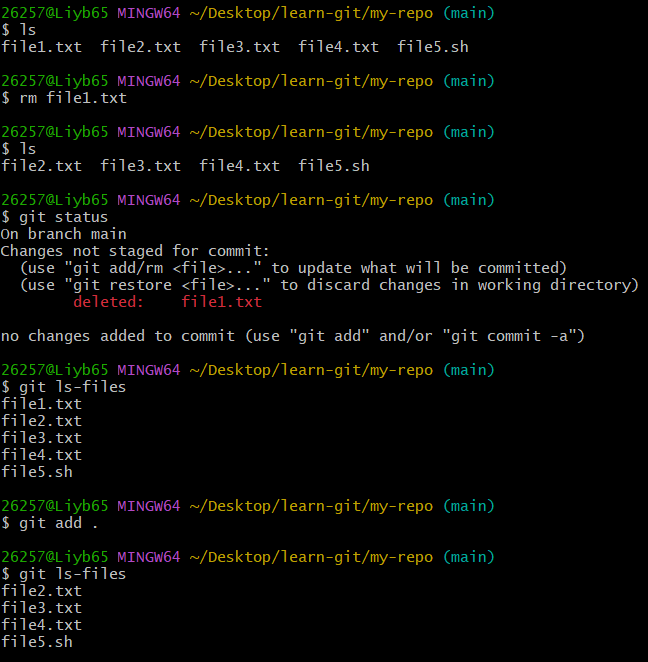

​	本地仓库和工作区的文件原来都有五个文件

​	先用rm命令在本地工作区删除文件，执行`rm file1.txt`，然后文件就在工作区中被删除了，仓库状态提示file1.txt被删除

​	上面只是在工作区删除文件，暂存区中文件并没有被删除，使用`git ls-files`可以看到暂存区中还是五个文件

​	然后执行`git add .`命令告诉git要删除某文件，将其从暂存区中移除掉，相当于更新暂存区状态

​	执行完后，发现暂存区中也把file1.txt也删除掉了

​	再提交，就能将仓库中的file1.txt删除掉

### git rm

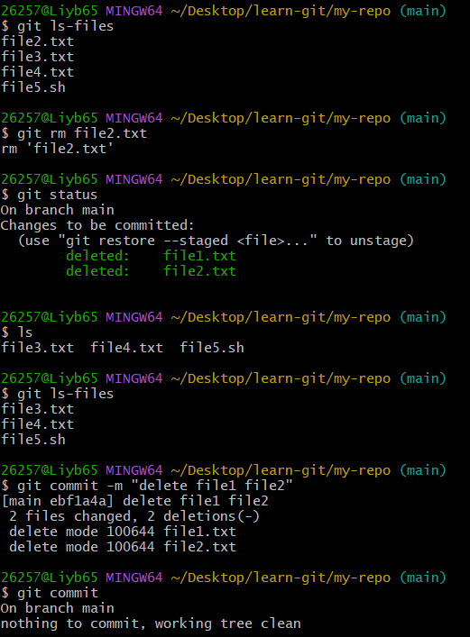

​	上面命令将file2.txt也从版本库中删除掉；直接使用`git rm file2.txt`

​	使用`git status`可以看到和file1一样，file2也被删除了；此外可以看到，file2在工作区和暂存区中也被删除掉了

​	**删除文件后一定要提交，否则版本库中还存在**

### 总结

| 命令                        | 功能                                     |
| --------------------------- | ---------------------------------------- |
| `rm file`<br>`git add file` | 先从工作区删除文件，然后再暂存删除内容   |
| `git rm <file>`             | 把文件从工作区和暂存区同时删除           |
| `git rm --cached <file>`    | 把文件从暂存区删除，但保留在当前工作区中 |
| `git rm -r*`                | 递归删除某个目录下的所有子目录和文件     |

​	**删除后不要忘记提交**


## gitignore忽略文件

​	这个文件的作用是可以让我们忽略掉一下不应该被加入到版本库中的文件，可以让仓库体积更小、更加干净

​	.gitignore文件的规则非常简单，我们可以在这个文件中列出需要忽略的文件的模式，这样这些文件就不会被提交到版本库中

### 应该忽略哪些文件

​	1、系统或者软件自动生成的文件

​	2、编译生成的中间文件和结果文件

​	3、运行时生成的日志文件、缓存文件、临时文件等

​	4、涉及身份、密码、口令、密钥等敏感信息的文件

