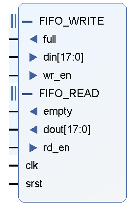
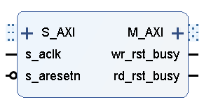
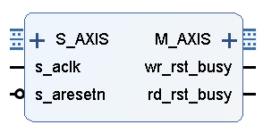

# 1. FIFO

​	Source中加粗的是顶层文件，综合的是Design Source中的顶层文件，仿真的是Simulation Source中的顶层文件

## 综合方式

### Global

​	每次编译整个工程时，IP核都要随着整个Verilog代码从零开始编译

### Out of Context per IP

​	模块化编译，为每个IP核创建单独的综合环境

### 选择

​	上板一般选择Out of context per IP，因为节省时间

​	仿真一般用Global，因为无需综合

## 例化模板

​	左上角Source窗口 ——> IP Source ——> Instantiation Template ——> 打开.veo文件
​	其中.veo文件是verilog的例化模板，.vho文件是VHDL的例化模板

## BRAM和Distributed RAM

​	**BRAM**：FPGA底层的Block RAM块（即SRAM）

​	**Distributed RAM**：利用LUT资源搭建的缓存

​	除非BRAM资源非常紧张，Distributed RAM一般不建议用

## 重要概念

​	fifo种类很多，一般用到的是fifo generator

### 工作原理

​	以水龙头放水为例，水龙头放水慢（输入慢），但我们人提水的时候是一次处理一桶水（输出快），所以需要一个水桶作为缓存，等存满一桶水，再一次提走。

​	又以喝水为例，一次接一杯水（输入快），渴的时候喝两口（输出慢），这里杯子作为缓存。

### 分类

​	根据FIFO输入时钟的区别，可以分为同步FIFO和异步FIFO

​	同步FIFO只有一个独立的时钟端口clock，所有的输入输出信号都同步于clock信号

​	异步FIFO有两个时钟，写端口和读端口分别有独立的时钟，所有写相关的信号都属于写时钟，所有读相关的信号都属于读时钟

​	FIFO一般不需要自己去写代码实现，FPGA官方软件都提供了FIFO IP，直接使用即可

### 应用场景

​	**接口数据/消息缓冲**：FIFO可以用于缓存数据或消息，以应对数据流量突发情况，同时降低或消除背压的频率，减小上级模块的复杂度

​	**接口协议隔离**：在模块与复杂的协议进行对接时，FIFO可以作为隔离后的用户接口，降低模块接口协议设计复杂度，并实现协议接口的IP化，提高系统的复用性

​	**跨时钟域处理**：FIFO可以用于处理异步时钟域的数据、消息和总线。通过FIFO，可以简单、快速、安全地跨时钟域处理

​	**数据位宽转换**：FIFO可以用于实现数据的位宽转换，例如从512位转换为256位

### 相关参数

#### Interface type

​	**Native interface FIFOs**：最基本的FIFO接口，包括数据输入、输出端口、写使能、读使能等信号

​	**AXI Memory mapped interface FIFOs**：将FIFO封装为一个AXI内存映射的IP核，可以通过AXI总线进行访问

​	**AXI-Stream interface FIFOs**：该接口兼容AXI-Stream协议，适合在流式数据传输场景中使用

#### 时钟类型和资源类型

​	**时钟**：

​		同步时钟（common clock）和异步时钟（independent clock）

​	**资源**：
​		block RAM、Distributed RAM、Shift Register、Built-in-FIFO

#### Read Mode

​	**Standard FIFO**：标准读模式，接收到读使能后下一个周期输出数据

​	**First Word Fall Through**：先入先出模式，缓存到一定长度数据后，则自动输出第一个数据，并保持这个数据输出

#### Data Port Parameter

​	**1、Write Width**：写数据位宽，可以自行随意设置

​	**2、Write Depth**：可以存储的数据的个数

​	**3、Read Width**：受写位宽限制，如写位宽是122，读位宽只能选61、122、244、488、976

​	**4、ECC，Output Register and Power Gating Options**：一般用不到

#### Status Flags

​	均可以不用，使用data count比almost full flag和almost empty flag信号更加高效和可控

#### Data Counts

​	More Accurate Data Count：确保异步FIFO能准确追踪FIFO中的元素量

​	同时rd_data_count和wr_data_count都需要经过一定的时钟延迟后才能输出准确的计数

​	**FIFO复位信号应保持三个周期及以上，同时异步FIFO复位后要经过十来个周期才能写入数据**

## 读取时刻的确定

​	为了使得读取到的数据连续，且读取延时最小，根据下面步骤来确定读取时刻：

​	1、计算读出带宽W1，W1 = 读取频率 × 读取位宽，如100MHz*4Byte = 400

​	2、计算写入带宽W2，W2 = 写入频率 × 写入位宽，如50MHz*2Byte = 100

​	假设突发长度为256

​	则400/100 = 4，则256 / 4 = 64，FIFO中写64字节的时间可以读出256个字节，256 - 64 = 192

​	读取位宽是写入位宽的两倍，所以192 / 2 = 96

​	为了防止FIFO被读空，加一个裕量，96 + 1 = 97

​	因此当wr_data_count = 97时，将rd_en拉高

​	这只是为了确定一个大概的数值范围，实际操作时观察在rd_en被拉高期间，empty信号有没被拉高，以确定读取的数据是否存在间断

