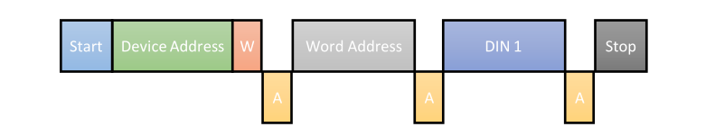
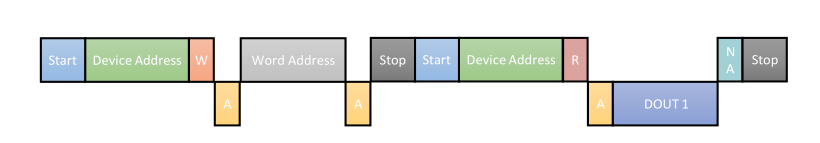

# 基本概念
I2C（Inter Integrate Circuit，内部集成电路总线），是由飞利浦半导体公司，在八十年代设计出来的一种简单、双向、两线式串行总线，用于连接微控制器及其外围设备，是微电子通信控制领域广泛采用的一种总线标准

I2C总线有三种数据传输速度：标准，快速模式和高速模式。标准下可达100kbps，快速模式下可达400kbps，高速模式下可达3.4Mbps

I2C总线的主要优点是简单和高效，由于接口直接在组件之上，I2C总线占用的空间非常小，减少了电路板的空间和芯片


上图中是一个具有多主机的I2C总线的系统结构图，各种主控器件和外围器件均并联在这条总线上，每个器件都有唯一的地址识别，在通信的时候，总线上必须要有一个器件为主器件，其它为从器件，主器件将数据传送到总线上，虽然所有的从器件都能接收到数据，但是只有与其相对应的地址的从器件才能做出应答反应，这就是分配地址编码的真正原因，就像电话机一样只有拨通各自的号码才能工作

I2C总线在传输数据过程中共有三种类型信号：起始信号、停止信号和应答信号

**起始信号**：在SCL和SDA均为高电平的前提下，检测到SDA有下降沿信号，则建立I2C通信，开始传输数据

**停止信号**：在SCL为高电平，SDA为低电平的前提下，检测到SDA有上升沿信号，则结束I2C通信，停止传输数据

**应答信号**：当主器件向从器件发送数据时，从器件在接收到8位数据后，也就是第九个时钟时，然后从器件向主器件发送特定的低电平脉冲，表示从器件已收到数据。反之，需要重新进行配置，直到接收到器件相应信号为止


从该图中可以看出，首先总线处于空闲状态，也就是总线上没有通信，SCL和SDA均为高电平；接着看起始信号处的虚线区域，从虚线区域可以看到SCL为高电平，SDA从高电平变成了低电平，这也就表示通信开始，可以传输数据了

再看应答信号，也就是第九个时钟，SDA为低电平，表示从设备已收到数据

再看停止信号处的虚线区域，虚线区域中SCL为高电平，SDA从低电平变成了高电平，表示通信结束，停止传输数据

即在SCL为高电平的情况下，SDA信号的转变就对通信起着强制性的作用，要么通信建立，要么通信结束，有且仅有这两种情况，也就是说，在数据交换的过程中，要对SCL这跟信号线尤为注意，在数据变化时，一定要保证SCL为低电平，让数据的变化在SCL的安全状态下进行，从图中也可以看出，**当SCL为高电平时，数据一定要稳定可靠，当SCL为低电平时，才可以改变数据**

# 写流程



从上图可以看出，I2C总线写流程如下：

1）主器件发出START信号，开始通信

2）主器件发出器件地址，器件地址需要查看器件的datasheet，8位地址由7位地址（D7-D0）和1位R/W读写位组成。若EEPROM的器件地址为0x50，低三位由芯片管脚$E_{2}$、$E_{1}$、$E_{0}$决定，如果是写（W，0），则EEPROM器件地址与写位拼接为0xA0，如果是读（R，1），则拼接为0xA1，当主器件发出器件地址后，便会等待从器件响应

3）如果I2C总线上存在着和请求的地址相对应的器件，那么从器件便会发送一个ACK信号通知主器件

4）主器件接到ACK信号后，则会发送一个8位的寄存器地址，这个寄存器地址也需要查看器件的datasheet，如EEPROM（AT24C02）总共有256个寄存器地址，当主器件发出寄存器地址后，同样会等待从器件响应

5）当器件接收到寄存器地址后，便会发送一个ACK信号通知主器件

6）主器件接收到ACK信号后，则会发送一个8位的寄存器数据，器件也就会工作在不同的状态下

7）从器件接收到寄存器数据后，便会发送一个ACK信号通知主器件

8）主器件发出STOP信号，停止通信

# 读流程



从上图可以看出，I2C总线读流程如下：

1）主器件发出START信号，开始通信

2）主器件发出器件地址和写操作信号，等待响应

3）从器件接收到器件地址后，发送ACK信号

4）主器件接收到ACK信号后，主器件发送寄存器地址，等待响应

5）从器件接收到寄存器地址后，发送ACK信号

6）主器件接收到ACK信号后，主器件发出STOP信号，停止通信（可有可无）

7）主器件再一次发出START信号，开始通信

8）主器件发出器件地址和读操作信号，等待响应

9）从器件接收到器件地址后，发送ACK信号

10）从器件发送寄存器数据，等待响应

11）主器件接收到数据以后，发送一个非应答信号（NO ACK），表示不再准备下一个数据，准备通信结束

12）主器件发送STOP信号，停止通信

第9步和第10步可以重复执行多次，表示顺序读取多个寄存器

# 代码实现
在FPGA中，SDA和SCL挂在FPGA上，是FPGA上的管脚，同时，FPGA作为主器件，其它设备作为从器件，一般再由一个top层封装，对i2c总线读写开始进行控制，只引出sda和scl管脚，i2c总线代码实现如下：

```verilog
module i2c_8bit_master #( 
    // 寄存器地址8bit，有256个地址
	parameter CLK_REF     = 50000000	,		// 参考时钟频率 —— 50M
	parameter CLK_FREQ    = 100000  	,		// I2C读写时钟频率 —— 100K
	parameter CFG_LEN     = 16  	    ,		// 配置长度，读写地址数
	parameter SLAVE_ADDR  = 7'h50				// 器件地址
	// 上面配置总的意思就是以100K的时钟读写EEPROM的16个地址中的数据
)
(
	input					clk				,	
	input					rst_n			,	
	
	output	reg				i2c_scl			,	// 单向时钟信号
	inout					i2c_sda			,	// 双向数据信号，能收也能发
	
	input					i2c_wr_start	,
	input					i2c_rd_start	,
		
	output	reg				i2c_rd_de		,	
	output 	reg		[7:0]	i2c_rd_data			
);
	reg					i2c_wr_en			;	
	reg					i2c_rd_en			;	

	reg		[15:0]		time_cnt			;
	reg		[7:0]		bit_cnt				;

	reg		[4:0]		fsm_cs				;
	reg		[4:0]		fsm_cs_r			;

	reg 	[7:0] 		dev_addr			;
	reg 	[7:0] 		reg_addr			;
	reg 	[7:0] 		reg_data			;

	reg					i2c_sda_de			;
	reg					i2c_sda_reg			;

	reg					i2c_ack1			;	// ack均为低电平
	reg					i2c_ack2			;
	reg					i2c_ack3			;
	reg 				i2c_stop			;

	reg		[7:0]		rom_addr			;
	reg		[15:0]		rom_data			;

	reg					i2c_cfg_done		;

	localparam		CLK_DIV         =	CLK_REF/CLK_FREQ ;
		
	/* 写I2C状态 I2C启动 + 器件地址 + 寄存器地址 + 寄存器数据 + I2C停止 */
	localparam		FSM_IDLE		=	0 ,	//空闲状态
					FSM_ABIT        =   1 ,	//仲裁状态		
					WR_START		=	2 ,	//写数据开始状态
					WR_DEVADDR		=	3 ,	//写器件地址状态
					WR_ACK1			=	4 ,	//器件响应状态
					WR_REGADDR		=	5 ,	//写寄存器地址状态
					WR_ACK2	   		=	6 ,	//寄存器地址响应状态
					WR_REGDATA		=	7 ,	//写寄存器数据状态
					WR_ACK3			=	8 ,	//寄存器数据响应状态
					WR_STOP			=	9 ;	//写数据停止状态
								
	/* 读I2C状态 I2C启动 + 器件地址 + 寄存器地址 + I2C启动 + 器件地址 + 寄存器数据 + I2C停止*/
	localparam		RD_START		=	10,	//读数据开始状态
					RD_DEVADDR1		=	11,	//写器件地址状态
					RD_ACK1			=	12,	//器件响应状态
					RD_REGADDR		=	13,	//写寄存器地址状态
					RD_ACK2			=	14,	//寄存器地址响应状态
					RD_READY		=	15,	//读数据准备状态
					RD_AGSTART		=	16,	//读数据再一次开始状态
					RD_DEVADDR2		=	17,	//写器件地址状态
					RD_ACK3			=	18,	//器件响应状态
					RD_REGDATA		=	19,	//读寄存器数据状态
					RD_NACK			=	20,	//无应答状态
					RD_AGSTOP		=	21;	//读数据再一次停止状态
	
    // i2c_wr_en，i2c_cfg_done拉高后下一个周期拉低，i2c_wr_start脉冲拉高后下一个周期拉高
	always@(posedge clk)                	
		if(!rst_n)
			i2c_wr_en <= 1'b0;
		else if(i2c_cfg_done==1'b1)
			i2c_wr_en <= 1'b0;
		else if(i2c_wr_start==1'b1)
			i2c_wr_en <= 1'b1;
		else
			i2c_wr_en <= i2c_wr_en;
	
    // i2c_rd_en，i2c_cfg_done拉高后下一个周期拉低，i2c_rd_start脉冲拉高后下一个周期拉高
	always@(posedge clk)
		if(!rst_n)
			i2c_rd_en <= 1'b0;
		else if(i2c_cfg_done==1'b1)
			i2c_rd_en <= 1'b0;
		else if(i2c_rd_start==1'b1)
			i2c_rd_en <= 1'b1;
		else
			i2c_rd_en <= i2c_rd_en;
	
    // 根据CLK_DIV进行分频
    // 正常的一个时钟周期，高电平低电平各占50%
    // 这里相当于只计数半个周期
	always@(posedge clk)
		if(!rst_n)
			time_cnt <= 0;
		else if(time_cnt==CLK_DIV-1)
			time_cnt <= 0;
		else
			time_cnt <= time_cnt + 1'b1;
	
    // 读写完成后，bit_cnt清零
    // 清零会慢一个clk周期，但因为一个比特持续CLK_DIV个周期，影响不大
    // time_cnt转0的同一个clk周期bit_cnt+1
    // 在一个长时钟周期的上升沿，bit_cnt同时+1
	always@(posedge clk)
		if(!rst_n)
			bit_cnt <= 0;	
		else if(fsm_cs!=fsm_cs_r)
			bit_cnt <= 0;
		else if(time_cnt==CLK_DIV-1)
			bit_cnt <= bit_cnt + 1'b1;  
		else
			bit_cnt <= bit_cnt;
	
    // fsm_cs_r用于清空比特计数器
    // i2c是串行总线，地址和数据都是一个比特一个比特的传输
    // 在传输地址时，fsm_cs始终保持在WR_REGADDR状态，传输数据时，fsm_cs始终保持在WR_REGDATA状态
    // 传输完成后，WR_REGADDR——>WR_ACK2，WR_REGDATA——>WR_ACK3
    // 此时fsm_cs_r != fsm_cs，比特计数器bit_cnt清零
    // 对于读状态也是如此
	always@(posedge clk)
		if(!rst_n)
			fsm_cs_r <= FSM_IDLE;
		else
			fsm_cs_r <= fsm_cs;

    // i2c总线核心——状态机
	always@(posedge clk)
		if(!rst_n)
			fsm_cs <= FSM_IDLE;
		else 
			case(fsm_cs)
                // 空闲状态时，若外部给出start信号，则进入abit状态
				FSM_IDLE:	
					if(i2c_wr_start==1'b1||i2c_rd_start==1'b1)
						fsm_cs <= FSM_ABIT;
					else
						fsm_cs <= fsm_cs;
                
                // 仲裁状态
                // 判断是否写完CFG_LEN个数据，每一趟流程走完只往ROM中写入一个数据
                // 全部写完后回到初始状态
				FSM_ABIT:					
					if(i2c_cfg_done==1'b1)
						fsm_cs <= FSM_IDLE;		
					else if(i2c_wr_en==1'b1&&time_cnt==CLK_DIV-1&&rom_addr<CFG_LEN)
						fsm_cs <= WR_START;
					else if(i2c_rd_en==1'b1&&time_cnt==CLK_DIV-1&&rom_addr<CFG_LEN)
						fsm_cs <= RD_START;
					else
						fsm_cs <= fsm_cs;																			
                // 写开始状态持续周期满后，下一个状态转为WR_DEVADDR，传输器件地址
				WR_START:		
					if(time_cnt==CLK_DIV-1)	
						fsm_cs <= WR_DEVADDR;
					else				
						fsm_cs <= fsm_cs;
                
				WR_DEVADDR:	
					if(time_cnt==CLK_DIV-1&&bit_cnt==7)	
						fsm_cs <= WR_ACK1;
					else				
						fsm_cs <= fsm_cs;
				WR_ACK1:	
					if(time_cnt==CLK_DIV-1)	
						fsm_cs <= WR_REGADDR;
					else				
						fsm_cs <= fsm_cs;
				WR_REGADDR:	
					if(time_cnt==CLK_DIV-1&&bit_cnt==7)	
						fsm_cs <= WR_ACK2;
					else	
						fsm_cs <= fsm_cs;
				WR_ACK2:		
					if(time_cnt==CLK_DIV-1)	
						fsm_cs <= WR_REGDATA;
					else				
						fsm_cs <= fsm_cs;
				WR_REGDATA:		
					if(time_cnt==CLK_DIV-1&&bit_cnt==7)	
						fsm_cs <= WR_ACK3;
					else				
						fsm_cs <= fsm_cs;
				WR_ACK3:		
					if(time_cnt==CLK_DIV-1)	
						fsm_cs <= WR_STOP;
					else		
						fsm_cs <= fsm_cs;
                
                // 写完一个8bit数据，回到仲裁状态
				WR_STOP:		
					if(time_cnt==CLK_DIV-1)	
						fsm_cs <= FSM_ABIT;
					else				
						fsm_cs <= fsm_cs;																		
				RD_START:	
					if(time_cnt==CLK_DIV-1)	
						fsm_cs <= RD_DEVADDR1;
					else				
						fsm_cs <= fsm_cs;
				RD_DEVADDR1:
					if(time_cnt==CLK_DIV-1&&bit_cnt==7)	
						fsm_cs <= RD_ACK1;
					else				
						fsm_cs <= fsm_cs;
				RD_ACK1:	
					if(time_cnt==CLK_DIV-1)	
						fsm_cs <= RD_REGADDR;
					else				
						fsm_cs <= fsm_cs;
				RD_REGADDR:	
					if(time_cnt==CLK_DIV-1&&bit_cnt==7)	
						fsm_cs <= RD_ACK2;
					else				
						fsm_cs <= fsm_cs;
				RD_ACK2:	
					if(time_cnt==CLK_DIV-1)	
						fsm_cs <= RD_READY;
					else				
						fsm_cs <= fsm_cs;
				RD_READY:	
					if(time_cnt==CLK_DIV-1)	
						fsm_cs <= RD_AGSTART;
					else				
						fsm_cs <= fsm_cs;			
				RD_AGSTART:
					if(time_cnt==CLK_DIV-1)	
						fsm_cs <= RD_DEVADDR2;
					else				
						fsm_cs <= fsm_cs;
				RD_DEVADDR2:
					if(time_cnt==CLK_DIV-1&&bit_cnt==7)	
						fsm_cs <= RD_ACK3;
					else				
						fsm_cs <= fsm_cs;
				RD_ACK3:		
					if(time_cnt==CLK_DIV-1)	
						fsm_cs <= RD_REGDATA;
					else				
						fsm_cs <= fsm_cs;
				RD_REGDATA:	
					if(time_cnt==CLK_DIV-1&&bit_cnt==7)	
						fsm_cs <= RD_NACK;
					else				
						fsm_cs <= fsm_cs;
				RD_NACK:	
					if(time_cnt==CLK_DIV-1)	
						fsm_cs <= RD_AGSTOP;
					else				
						fsm_cs <= fsm_cs;
				RD_AGSTOP:		
					if(time_cnt==CLK_DIV-1)	
						fsm_cs <= FSM_ABIT;
					else				
						fsm_cs <= fsm_cs;
					
				default:fsm_cs <= fsm_cs;
			endcase
	
    // i2c_scl电平控制信号
	always@(posedge clk)
		if(!rst_n)
            // i2c_scl默认为高电平
			i2c_scl <= 1'b1;
		else
            // 由前面波形图可以看到，当传输数据和响应信号时，SCL会出现高低波形，相当于时钟
            // 这里选择一个周期的1/4到3/4拉高
            // 其余情况默认拉低
			case(fsm_cs)
				WR_DEVADDR,WR_ACK1,WR_REGADDR,WR_ACK2,WR_REGDATA,WR_ACK3,RD_DEVADDR1,
				RD_ACK1,RD_REGADDR,RD_ACK2,RD_DEVADDR2,RD_ACK3,RD_REGDATA,RD_NACK:
					if(time_cnt>=CLK_DIV/4&&time_cnt<CLK_DIV/4*3)
						i2c_scl <= 1'b1;
					else
						i2c_scl <= 1'b0;
				default: i2c_scl <= 1'b1;
			endcase		

    // i2c_sda寄存器，需要这么个寄存器的原因是i2c_sda是双向的
    // ACK和从机向主机发送数据时
	always@(posedge clk)
		if(!rst_n)
			i2c_sda_reg <= 1'b1;
		else 
			case(fsm_cs)
				FSM_IDLE,FSM_ABIT,RD_NACK:
					i2c_sda_reg <= 1'b1;
				
				WR_START,WR_STOP,RD_START,RD_AGSTART,RD_AGSTOP:	
					i2c_sda_reg <= 1'b0;
				
                // 结合下一个always语句块，左移，数据和地址都是先发最高位
				WR_DEVADDR,RD_DEVADDR1,RD_DEVADDR2:
					if(time_cnt==0)
						i2c_sda_reg <= dev_addr[7];
					else
						i2c_sda_reg <= i2c_sda_reg;
				
				WR_REGADDR,RD_REGADDR:
					if(time_cnt==0)
						i2c_sda_reg <= reg_addr[7];
					else
						i2c_sda_reg <= i2c_sda_reg;
					
				WR_REGDATA:
					if(time_cnt==0)
						i2c_sda_reg <= reg_data[7];
					else
						i2c_sda_reg <= i2c_sda_reg;			
				
                // 再scl为低电平时，将sda拉高，以便产生下一个start信号
				RD_ACK2:
					if(time_cnt>=CLK_DIV/4*3+CLK_DIV/8)
						i2c_sda_reg <= 1'b1;
					else
						i2c_sda_reg <= i2c_sda_reg;
				
				default: i2c_sda_reg <= i2c_sda_reg;
			endcase		
			
	always@(posedge clk)
		if(!rst_n)
			dev_addr <= 0;
		else 
			case(fsm_cs)
				WR_START,RD_START:
					dev_addr <= {SLAVE_ADDR[6:0],1'b0};
					
				RD_AGSTART:	
					dev_addr <= {SLAVE_ADDR[6:0],1'b1};
					
				WR_DEVADDR,RD_DEVADDR1,RD_DEVADDR2:	
					if(time_cnt==CLK_DIV/2)
						dev_addr <= {dev_addr[6:0],1'b0};
					else
						dev_addr <= dev_addr;	
						
				default: dev_addr <= dev_addr;
			endcase

	always@(posedge clk)
		if(!rst_n)
			reg_addr <= 0;
		else 
			case(fsm_cs)
				WR_START,RD_START,RD_AGSTART:
					reg_addr <= rom_data[15:8]; 
				
				WR_REGADDR,RD_REGADDR:		
					if(time_cnt==CLK_DIV/2)
						reg_addr <= {reg_addr[6:0],1'b0};
					else
						reg_addr <= reg_addr;
					
				default: reg_addr <= reg_addr;
			endcase

	always@(posedge clk)
		if(!rst_n)
			reg_data <= 0;
		else 
			case(fsm_cs)	
				WR_START,RD_START,RD_AGSTART:
					reg_data <= rom_data[7:0]; 
				
				WR_REGDATA:	
					if(time_cnt==CLK_DIV/2)
						reg_data <= {reg_data[6:0],1'b0};
					else
						reg_data <= reg_data;	
					
				default: reg_data <= reg_data;
			endcase		

    // 读使能
	always@(posedge clk)
		if(!rst_n)
			i2c_rd_de <= 1'b0;	
		else if(fsm_cs==RD_REGDATA&&time_cnt==CLK_DIV-1&&bit_cnt==7)
			i2c_rd_de <= 1'b1;
		else
			i2c_rd_de <= 1'b0;
	
    // i2c先发高位
	always@(posedge clk)
		if(!rst_n)
			i2c_rd_data <= 0;	
		else if(fsm_cs==RD_REGDATA&&time_cnt==CLK_DIV/2)
			i2c_rd_data <= {i2c_rd_data[6:0],i2c_sda};
		else
			i2c_rd_data <= i2c_rd_data;
	
    // 控制sda方向
	always@(posedge clk)
		if(!rst_n)
			i2c_sda_de <= 1'b0;	// sda作为输入
		else 
			case(fsm_cs)
				WR_ACK1,WR_ACK2,WR_ACK3,RD_ACK1,RD_ACK2,RD_ACK3,RD_REGDATA:		
					i2c_sda_de <= 1'b0;		// sda作为输入
				default: i2c_sda_de <= 1'b1;	// sda作为发送
			endcase

	always@(posedge clk)
		if(!rst_n)
			i2c_ack1 <= 1'b0;
		else if((fsm_cs==WR_ACK1||fsm_cs==RD_ACK1)&&time_cnt==CLK_DIV/2)
			i2c_ack1 <= i2c_sda;
		else
			i2c_ack1 <= i2c_ack1;

	always@(posedge clk)
		if(!rst_n)
			i2c_ack2 <= 1'b0;
		else if((fsm_cs==WR_ACK2||fsm_cs==RD_ACK2)&&time_cnt==CLK_DIV/2)
			i2c_ack2 <= i2c_sda;
		else
			i2c_ack2 <= i2c_ack2;

	always@(posedge clk)
		if(!rst_n)
			i2c_ack3 <= 1'b0;
		else if((fsm_cs==WR_ACK3||fsm_cs==RD_ACK3)&&time_cnt==CLK_DIV/2)
			i2c_ack3 <= i2c_sda;
		else
			i2c_ack3 <= i2c_ack3;	
			
	always@(posedge clk)
		if(fsm_cs==WR_STOP||fsm_cs==RD_AGSTOP)
			i2c_stop = 1'b1;
		else
			i2c_stop = 1'b0;	
	
    // i2c_cfg_done，读写完后下一个周期拉高，否则保持低电平
	always@(posedge clk)
		if(rom_addr==CFG_LEN)
			i2c_cfg_done <= 1'b1;
		else
			i2c_cfg_done <= 1'b0;	
	
    // 三态门控制逻辑（固定语法），用于实现双向通信
    // i2c_sda_de为1时，主机主动驱动sda线
    // i2c_sda_de为0时，主机释放SDA线，允许从机控制SDA
	assign	i2c_sda = i2c_sda_de?i2c_sda_reg:1'bz;

	always@(posedge clk)
		if(!rst_n)
			rom_addr <= 0;
		else if(rom_addr==CFG_LEN)
			rom_addr <= 0;
		else if((fsm_cs==WR_STOP||fsm_cs==RD_AGSTOP)&&time_cnt==CLK_DIV-1)
			rom_addr <= rom_addr + 1'b1;
		else
			rom_addr <= rom_addr;
	
    // rom_data高8位是EEPROM地址，低8位是写入EEPROM对应地址的数据
	always@(posedge clk)
		if(!rst_n)
			rom_data <= 0;
		else 
			case(rom_addr)
				0  : 	rom_data <= {8'h00,8'h00};					
				1  : 	rom_data <= {8'h01,8'h01};					
				2  : 	rom_data <= {8'h02,8'h02};																				
				3  : 	rom_data <= {8'h03,8'h03};																					
				4  : 	rom_data <= {8'h04,8'h04};																		
				5  : 	rom_data <= {8'h05,8'h05};				
				6  : 	rom_data <= {8'h06,8'h06};				
				7  : 	rom_data <= {8'h07,8'h07};
				8  : 	rom_data <= {8'h08,8'h08};					
				9  : 	rom_data <= {8'h09,8'h09};					
				10 : 	rom_data <= {8'h0A,8'h0A};																				
				11 : 	rom_data <= {8'h0B,8'h0B};																					
				12 : 	rom_data <= {8'h0C,8'h0C};																		
				13 : 	rom_data <= {8'h0D,8'h0D};				
				14 : 	rom_data <= {8'h0E,8'h0E};				
				15 : 	rom_data <= {8'h0F,8'h0F};
				default:rom_data <= {8'h00,8'h00};
			endcase
endmodule
```

I2C总线的核心可以用下面状态机表示：


对于多字节地址，或多字节数据，其状态进行适当修改即可，如2字节地址1字节数据，i2c一般先发高8位，再发低8位,其状态如下：

```verilog
/* 写I2C状态 I2C启动 + 寄存器地址高8bit + 寄存器地址低8bit + 寄存器地址 + 寄存器数据 + I2C停止 */
localparam		FSM_IDLE		=	0 ,	//空闲状态
				FSM_ABIT        =   1 ,	//仲裁状态		
				WR_START		=	2 ,	//写数据开始状态
				WR_DEVADDR		=	3 ,	//写器件地址状态
				WR_ACK1			=	4 ,	//器件响应状态
				WR_REGADDR1		=	5 ,	//写寄存器地址高8位状态
				WR_ACK2	   		=	6 ,	//寄存器地址响应状态
				WR_REGADDR2		=	7 ,	//写寄存器地址低8位状态
				WR_ACK3	   		=	8 ,	//寄存器地址响应状态
				WR_REGDATA		=	9 ,	//写寄存器数据状态
				WR_ACK4			=	10,	//寄存器数据响应状态
				WR_STOP			=	11;	//写数据停止状态
					
/* 读I2C状态 I2C启动 + 器件地址 + 寄存器地址高8bit + 寄存器地址低8bit + I2C启动 + 器件地址 + 寄存器数据 + I2C停止*/
localparam		RD_START		=	12,	//读数据开始状态
				RD_DEVADDR1		=	13,	//写器件地址状态
				RD_ACK1			=	14,	//器件响应状态
				RD_REGADDR1		=	15,	//写寄存器地址高8位状态
				RD_ACK2			=	16,	//寄存器地址响应状态
				RD_REGADDR2		=	17,	//写寄存器地址低8位状态
				RD_ACK3			=	18,	//寄存器地址响应状态
				RD_READY		=	19,	//读数据准备状态
				RD_AGSTART		=	20,	//读数据再一次开始状态
				RD_DEVADDR2		=	21,	//写器件地址状态
				RD_ACK4			=	22,	//器件响应状态
				RD_REGDATA		=	23,	//读寄存器数据状态
				RD_NACK			=	24,	//无应答状态
				RD_AGSTOP		=	25;	//读数据再一次停止状态
```


