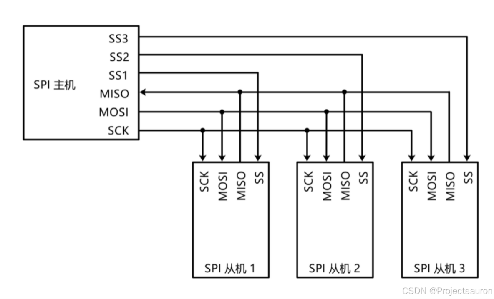

# 基本概念

SPI（Serial Peripheral Interface，串行外围设备接口）通信协议是Motorola公司首先在其MC68HCXX系列处理器上定义的，SPI接口是一种高速的**全双工同步**的通信总线，已经广泛应用在总舵MCU、存储芯片、AD转换器和LCD之间

# 引脚信息

**MISO（Master In / Slave Out）**：主设备数据输入，从设备数据输出

**MOSI（Master Out / Slave In）**：主设备数据输出，从设备数据输入

**SCLK（Serial Clock）**：时钟信号，由主设备产生

**CS（Chip Select）**：从设备片选信号，由主设备产生

# 工作原理

在主机和从机都有一个串行移位寄存器，主机通过向它的SPI串行寄存器写入一个字节来发起一次传输，串行移位寄存器通过MOSI信号线将字节发送给从机，从机也将自己的串行移位寄存器中的内容通过MISO信号线返回主机。这样，两个移位寄存器中的内容就被交换（高位先行）。外设的写操作和读操作是同步完成的。如果只是进行写操作，主机只需忽略接收到的字节；反之，若主机要读取从机的一个字节，就必须发送一个空字节引发从机传输

假设主机有个数据10101010要发送给从机，同时从机也有个数据01010101要发送给主机

首先驱动时钟，先产生一个上升沿，这时，所有的位，会往左移动一次，从最高位移出的数据，就会放到通信线上（实际上）