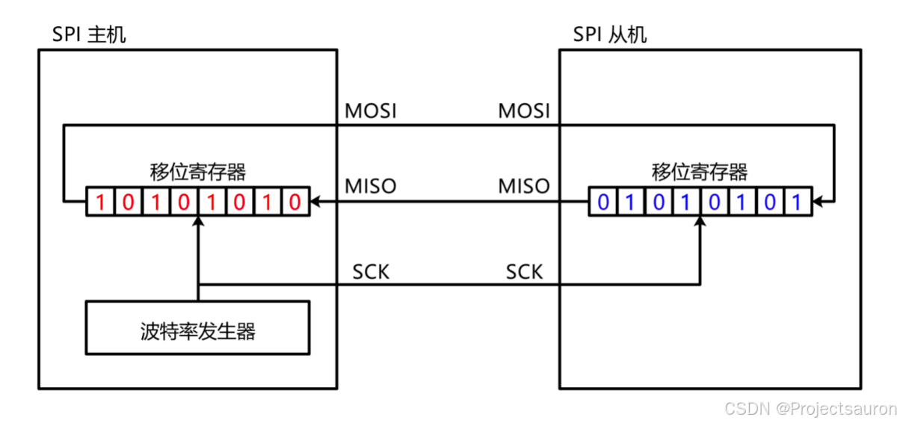
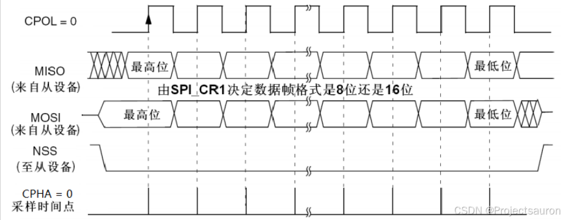
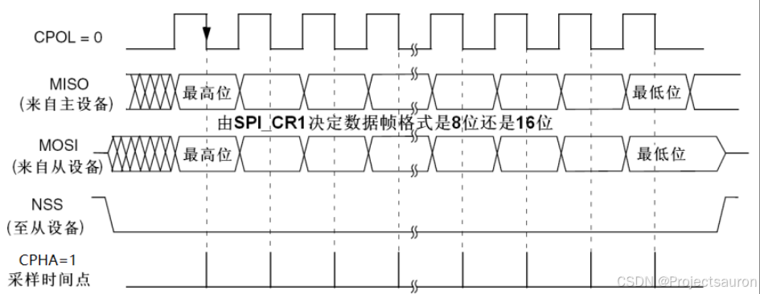
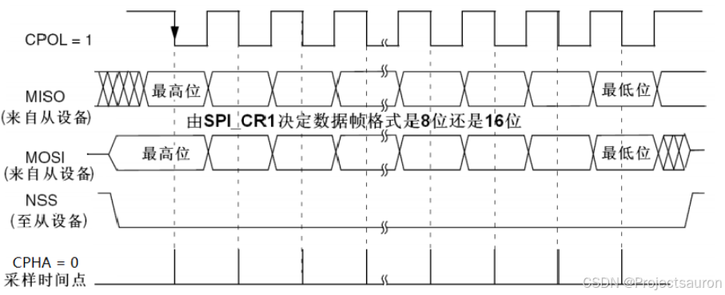
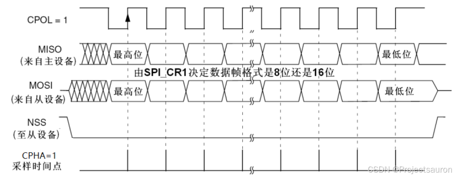

# 基本概念

SPI（Serial Peripheral Interface，串行外围设备接口）通信协议是Motorola公司首先在其MC68HCXX系列处理器上定义的，SPI接口是一种高速的**全双工同步**的通信总线，已经广泛应用在总舵MCU、存储芯片、AD转换器和LCD之间


# 引脚信息

**MISO（Master In / Slave Out）**：主设备数据输入，从设备数据输出

**MOSI（Master Out / Slave In）**：主设备数据输出，从设备数据输入

**SCLK（Serial Clock）**：时钟信号，由主设备产生

**CS（Chip Select）**：从设备片选信号，由主设备产生

# 工作原理

在主机和从机都有一个串行移位寄存器，主机通过向它的SPI串行寄存器写入一个字节来发起一次传输，串行移位寄存器通过MOSI信号线将字节发送给从机，从机也将自己的串行移位寄存器中的内容通过MISO信号线返回主机。这样，两个移位寄存器中的内容就被交换（高位先行）。外设的写操作和读操作是同步完成的。如果只是进行写操作，主机只需忽略接收到的字节；反之，若主机要读取从机的一个字节，就必须发送一个空字节引发从机传输



假设主机有个数据10101010要发送给从机，同时从机也有个数据01010101要发送给主机

首先驱动时钟，先产生一个上升沿，这时，所有的位，会往左移动一次，从最高位移出的数据，就会放到通信线上（实际上是放到了输出数据寄存器），此时MOSI数据是1，所以MOSI的电平是高电平；而MISO的数据是0，所以MISO的电平就是低电平，这就是第一个时钟上升沿执行的结果。然后把主机和从机中移位寄存器的最高位分别放到MOSI和MISO的通信线上，这就是数据的输出

之后时钟继续运行，上升沿之后，下一个边沿就是下降沿，在下降沿时，主机和从机内都会进行数据采样输入，也就是，MOSI的1，会采样输入到从机这里的最低位；MISO的0，会采样输入到从机这里的最低位，这就是第一个时钟结束后的现象，也就是原始数据的最高位，输出到MOSI，从机现在的最高位，输出到MISO，变成主机的最低位，八个时钟后，原来主机的10101010，跑到从机里，而原来从机里的01010101跑到主机里了

这样就实现了主机和从机一个字节的数据交换，SPI的数据收发都是基于字节交换这个基本单元来实现的，当主机需要发送一个字节的同时接收一个字节时，就可以执行一下字节交换的时序，这样主机要发送的数据跑到从机，主机要从从机接收的部分，跑到主机，这就完成发送同时接收的目的。

如果只想发送不想接收，和原来一样，只是这次接收到的数据不看他就行了，只想接收不想发送就随便发一个数据只要能把从机的数据置换过来就行了，读取置换过来的数据，这里随便发过去的数据从机不会去看它，一般在主机接收的时候，统一发$0x00$或$0xFF$，去跟从机交换数据

# 工作模式

**起始条件**：SS从高电平切换到低电平

**终止条件**：SS从低电平切换到高电平

因此，在从机的整个选中状态中，SS要时钟保持为低电平


由于CPOL（时钟极性）和CPHA（时钟相位）都有两种不同状态，所以SPI分成了四种模式，在开发时一般使用的是模式0和模式3，如下表所示


| SPI工作模式 | CPOL | CPHA | SCK空闲状态 | 采样边沿 | 采样时刻 |
| ----------- | ---- | ---- | ----------- | -------- | -------- |
| 0           | 0    | 0    | 低电平      | 上升沿   | 奇数边沿 |
| 1           | 0    | 1    | 低电平      | 下降沿   | 偶数边沿 |
| 2           | 1    | 0    | 高电平      | 下降沿   | 奇数边沿 |
| 3           | 1    | 1    | 高电平      | 上升沿   | 偶数边沿 |

一般选择工作模式0

## 工作模式0

空闲状态时钟为低电平，在第一个上升沿（奇数边沿）就发送数据



## 工作模式1

空闲状态时钟为低电平，在第一个下降沿（偶数边沿）就发送数据



## 工作模式2

空闲状态时钟为高电平，在第一个下降沿（奇数边沿）就发送数据



## 工作模式3

空闲状态时钟为高电平，在第一个上升沿（偶数边沿）就发送数据


# 代码实现

```verilog
module spi_master (
    input               clk       		,
    input               rst_n     		,
	
    // tx_de只需要保持一个周期，tx_en要等发送完后才能拉高
    input				tx_en			,   // 发送使能
	input               tx_de     		,   // 单周期拉高，对应一个数据
	input        [7:0]  tx_data   		,
	output  reg         tx_done   		,   // 一个数据发送完毕的标志
		
	input				rx_en			,   // 接收使能
    output				rx_de			,   // 接收数据使能
    output  	 [7:0]  rx_data 		,
	output  reg         rx_done   		,   // 一个数据接收完毕的标志
		
    output  reg         spi_clk 		,   
	output  reg         spi_cs  		,
    input               spi_miso  		,
    output  reg         spi_mosi    	
);
	reg [7:0]	tx_latch        ;
	reg [7:0]   tx_state        ; 

	reg [7:0]	rx_latch        ;
	reg [7:0]   rx_state        ;
	
    // 根据tx_de信号，将要发送的数据锁存，然后并转串
	always@(posedge clk)
		if(!rst_n)
			tx_latch <= 0;
		else if(tx_de==1'b1)
			tx_latch <= tx_data;	
		else
			tx_latch <= tx_latch;		
	
    // 要工作（发送或接收时），将片选信号拉低
    // 工作结束后，拉高，再次进入空闲状态
	always@(posedge clk)
		if(!rst_n)
			spi_cs <= 1'b1;
		else if(tx_en==1'b1||rx_en==1'b1)
			spi_cs <= 1'b0;
		else
			spi_cs <= 1'b1;	

	assign rx_de   = rx_done;
	assign rx_data = rx_latch;
	
    // tx_en和rx_en分别在两个条件分支中
    // 因此实际的实现效果是半双工
    // 实际应用时，一般用不到全双工的情况
	always@(posedge clk)
		if(!rst_n)
			begin
				spi_clk   	<=  0    ;
				spi_mosi  	<=  0    ;
				tx_done     <=  0    ;
				rx_done   	<=  0    ;
				rx_latch  	<=  0    ;
				tx_state  	<=  0    ;
				rx_state  	<=  0    ;	
			end 
		else if(tx_en==1'b1)
			case(tx_state)
				2,4,6,8,10,12,14:                
					begin
						spi_clk   <=  1'b1                	;
						tx_state  <=  tx_state + 1'b1   	;
					end					
				0:
					begin
						spi_mosi  <=  1'b0        			;
						spi_clk   <=  1'b0                	;
						tx_state  <=  tx_state + 1'b1   	;
					end											
				1:
					begin
						spi_mosi  <=  tx_latch[7]        	;
						spi_clk   <=  1'b0                	;
						tx_state  <=  tx_state + 1'b1   	;
					end
				3: 
					begin
						spi_mosi  <=  tx_latch[6]        	;
						spi_clk   <=  1'b0                	;
						tx_state  <=  tx_state + 1'b1   	;
					end
				5: 
					begin
						spi_mosi  <=  tx_latch[5]        	;
						spi_clk   <=  1'b0                	;
						tx_state  <=  tx_state + 1'b1   	;
					end 
				7:  
					begin
						spi_mosi  <=  tx_latch[4]        	;
						spi_clk   <=  1'b0                	;
						tx_state  <=  tx_state + 1'b1   	;
					end 
				9: 
					begin
						spi_mosi  <=  tx_latch[3]        	;
						spi_clk   <=  1'b0                	;
						tx_state  <=  tx_state + 1'b1   	;
					end                            
				11:
					begin
						spi_mosi  <=  tx_latch[2]        	;
						spi_clk   <=  1'b0                	;
						tx_state  <=  tx_state + 1'b1   	;
					end 
				13: 
					begin
						spi_mosi  <=  tx_latch[1]        	;
						spi_clk   <=  1'b0                	;
						tx_state  <=  tx_state + 1'b1   	;
					end 
				15: 
					begin
						spi_mosi  <=  tx_latch[0]        	;
						spi_clk   <=  1'b0                	;
						tx_state  <=  tx_state + 1'b1   	;
					end
				16: 
					begin
						spi_clk   <=  1'b1                	;
						tx_state  <=  tx_state + 1'b1   	;
						tx_done   <=  1'b1                	;
					end													
				17: 
					begin
						spi_mosi  <=  1'b0        			;
						spi_clk   <=  1'b0                	;
						tx_state  <=  0   					;
						tx_done   <=  1'b0                	;
					end				
				default:
					begin
						spi_mosi  <=  1'b0        			;
						spi_clk   <=  1'b0                	;
						tx_state  <=  0   					;
						tx_done   <=  1'b0                	;
					end
			endcase 
	   else if(rx_en==1'b1) 
			case(rx_state)
				0,2,4,6,8,10,12,14:               
					begin
						spi_clk       <=  1'b0                	;
						rx_state      <=  rx_state + 1'b1   	;
					end					
				1: 
					begin                       
						spi_clk       <=  1'b1                	;
						rx_state      <=  rx_state + 1'b1   	;
						rx_done       <=  1'b0                	;
						rx_latch[7]   <=  spi_miso          	;   
					end
				3: 
					begin
						spi_clk       <=  1'b1                	;
						rx_state      <=  rx_state + 1'b1   	;
						rx_done       <=  1'b0                	;
						rx_latch[6]   <=  spi_miso          	; 
					end
				5: 
					begin
						spi_clk       <=  1'b1                	;
						rx_state      <=  rx_state + 1'b1   	;
						rx_done       <=  1'b0                	;
						rx_latch[5]   <=  spi_miso          	; 
					end 
				7:  
					begin
						spi_clk       <=  1'b1                	;
						rx_state      <=  rx_state + 1'b1   	;
						rx_done       <=  1'b0                	;
						rx_latch[4]   <=  spi_miso          	; 
					end 
				9:  
					begin
						spi_clk       <=  1'b1                	;
						rx_state      <=  rx_state + 1'b1   	;
						rx_done       <=  1'b0                	;
						rx_latch[3]   <=  spi_miso          	; 
					end                            
				11:  
					begin
						spi_clk       <=  1'b1                	;
						rx_state      <=  rx_state + 1'b1   	;
						rx_done       <=  1'b0                	;
						rx_latch[2]   <=  spi_miso          	; 
					end 
				13:   
					begin
						spi_clk       <=  1'b1                	;
						rx_state      <=  rx_state + 1'b1   	;
						rx_done       <=  1'b0                	;
						rx_latch[1]   <=  spi_miso          	; 
					end 
				15:   
					begin
						spi_clk       <=  1'b1                	;
						rx_state      <=  rx_state + 1'b1   	;
						rx_done       <=  1'b1                	;
						rx_latch[0]   <=  spi_miso          	; 
					end		
				16:  
					begin
						spi_clk       <=  1'b0                	;
						rx_state      <=  0						;
						rx_done       <=  1'b0                	; 
					end		
				default:
					begin
						spi_clk       <=  1'b0                	;
						rx_state      <=  0   					;
						rx_done       <=  1'b0                	;
						rx_latch  	  <=  0    					;					
					end
			endcase    
		else
			begin
				tx_state  <=  0    ;
				rx_state  <=  0    ;
				tx_done	  <=  0    ;
				rx_done   <=  0    ;
				spi_clk   <=  0    ;
				spi_mosi  <=  0    ;
				rx_latch  <=  0    ;
			end      
endmodule
```

# flash
flash相较于EEPROM内存更大，读写更快

由于制造工艺，flash中数据只能从1变到0，不能从0变到1，所以在写入前要先擦除成0xFF，才能写入数据

flash内存结构：字节 ——> 页 ——> 扇区 ——> 块

EEPROM就是简单的地址和数据，flash还有指令和操作，更为复杂

页写，就是发送一个页的首地址，就能填充满一页，不需要逐个地址发送

写保护就是不允许写入，将写入数据忽略


## flash操作步骤

1、发送flash id指令，接收id并判断id是否正确

2、发送写使能指令

3、发送擦除指令及擦除首地址

4、读状态寄存器，当状态寄存器的最低位为0时，代表擦除完成

5、发送写使能指令

6、发送页写指令及页写首地址

7、读状态寄存器，当状态寄存器的最低位为0时，代表写入完成

8、发送读取指令，接收数据